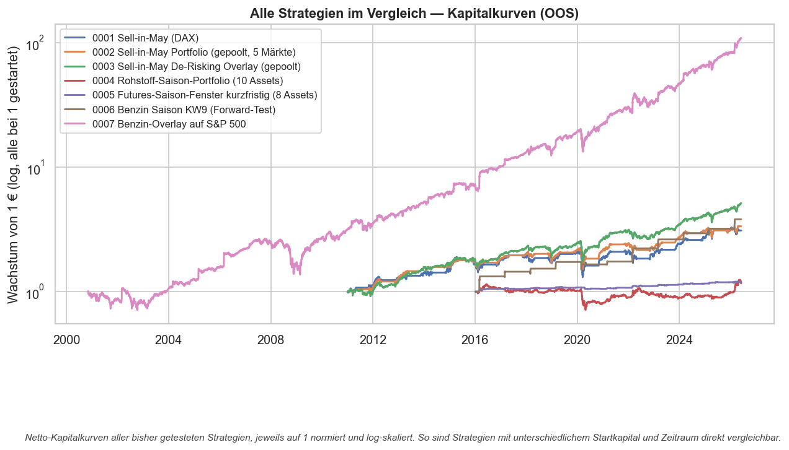
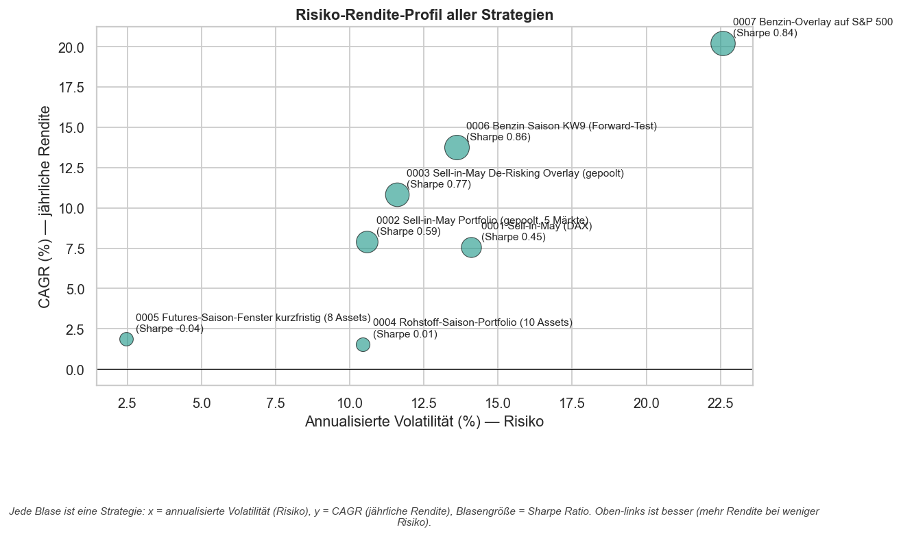

# Strategie-Übersicht — globaler Vergleich

Automatisch erzeugt aus den Ergebnissen aller getesteten Strategien
(`reports/build_comparison.py`). Alle Zahlen sind **out-of-sample, netto nach
Kosten**.

## Kennzahlen im Vergleich

| ID   | Strategie                                     |   CAGR | Volatilität | Sharpe |  Max DD |
| ---- | --------------------------------------------- | -----: | ----------: | -----: | ------: |
| 0001 | Sell-in-May (DAX)                             |  7.57% |      14.10% |   0.45 | -38.78% |
| 0002 | Sell-in-May Portfolio (gepoolt, 5 Märkte)     |  7.90% |      10.57% |   0.59 | -32.35% |
| 0003 | Sell-in-May De-Risking Overlay (gepoolt)      | 10.83% |      11.59% |   0.77 | -32.35% |
| 0004 | Rohstoff-Saison-Portfolio (10 Assets)         |  1.55% |      10.45% |   0.01 | -37.99% |
| 0005 | Futures-Saison-Fenster kurzfristig (8 Assets) |  1.87% |       2.46% |  -0.04 |  -4.26% |
| 0006 | Benzin Saison KW9 (Forward-Test)              | 13.75% |      13.60% |   0.86 | -13.32% |
| 0007 | Benzin-Overlay auf S&P 500                    | 20.22% |      22.58% |   0.84 | -48.61% |

## Visualisierungen

*Kapitalkurven aller Strategien, auf 1 normiert (log-Skala) — direkt vergleichbar
unabhängig vom Startkapital.*

*Risiko-Rendite-Profil: x = Volatilität (Risiko), y = CAGR (Rendite),
Blasengröße = Sharpe Ratio. Oben-links ist besser.*

## Einordnung

Bisher hat **keine** Strategie einen statistisch signifikanten Renditevorteil
gegenüber Buy & Hold gezeigt. Der gepoolte Sell-in-May-Ansatz (0002) hebt zwar
den Sharpe gegenüber jedem Einzelmarkt (Diversifikation) und senkt die
Volatilität, bleibt aber netto hinter Buy & Hold zurück und ist im
Permutationstest nicht signifikant. Der Wert des Effekts liegt damit in der
**Risikoreduktion** (Volatilitäts-Overlay), nicht in zusätzlicher Rendite.
