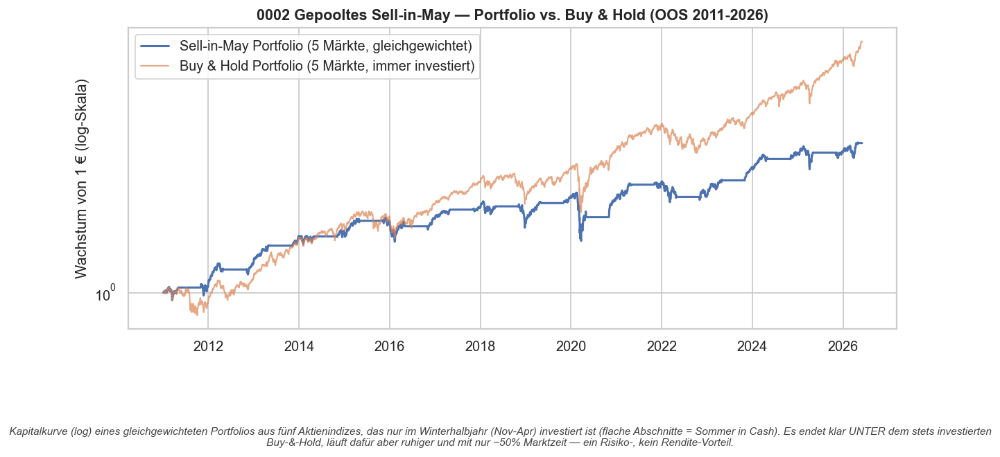
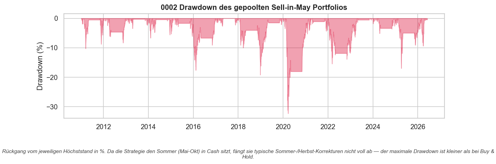
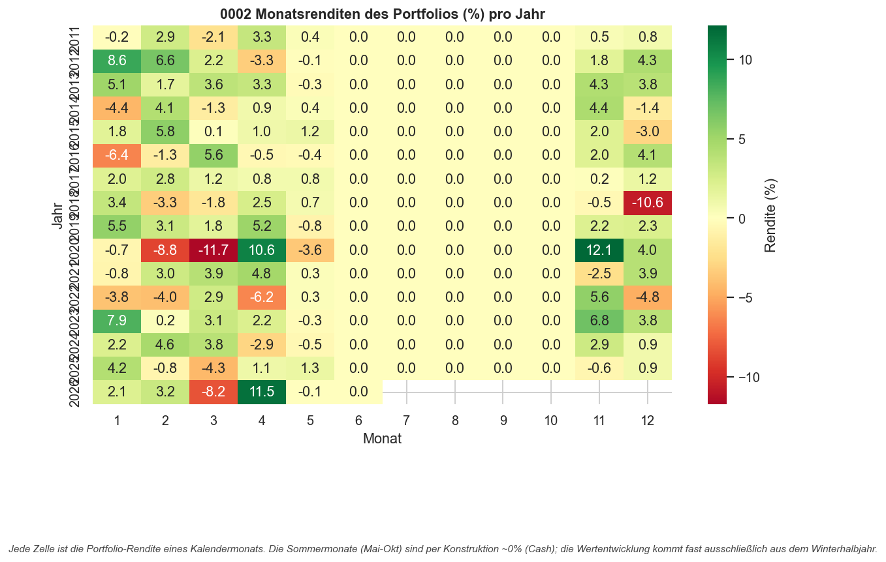
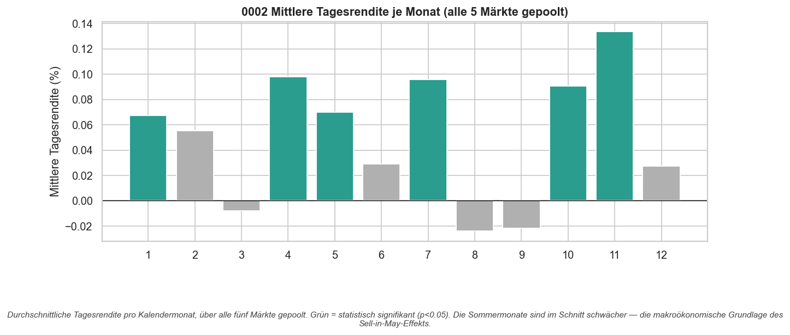

# Strategie 0002 — Gepooltes Sell-in-May (Halloween-Overlay)

- **Kategorie:** seasonal
- **Status:** abgelehnt als Renditequelle / Kandidat als Risiko-Overlay
- **Datum:** 2026-06-03
- **Universum:** S&P 500 (USA), Nasdaq 100 (USA), DAX (Deutschland),
  FTSE 100 (UK), Nikkei 225 (Japan)
- **Stichprobe:** Out-of-Sample 2011–2026 (ehrliche Auswertung, netto nach Kosten)

## 1. Motivation (folgt direkt aus Strategie 0001)

Strategie 0001 hat gezeigt: Der **Sell-in-May-Effekt** (long im Winterhalbjahr
November–April, im Sommer in Cash) ist über **alle fünf Aktienmärkte hinweg
positiv und konsistent** — aber pro Markt gibt es nur ~16 Trades. Das ist zu
wenig, um den Effekt einzeln statistisch von Zufall zu trennen (die
Permutationstests pro Markt waren schwach).

Der ehrliche nächste Schritt ist **Pooling**: Wir handeln den Effekt
gleichzeitig in allen fünf Märkten als **ein gleichgewichtetes Portfolio**. Das
- vervielfacht die Trade-Zahl (5 × 16 = **80 Trades**) → echte statistische Power,
- diversifiziert das länderspezifische Risiko weg,
- und gibt Permutationstest und Deflated Sharpe erstmals genug Aussagekraft.

Die Hypothese (gepooltes Sell-in-May) wurde aus dem Panel von 0001
**vorab festgelegt** — das hier ist ein Bestätigungstest, keine neue Suche.

## 2. Makro-Begründung

Das Sommerhalbjahr (Mai–Oktober) ist historisch schwächer: saisonale
Liquiditätszyklen, geringere Risikobereitschaft in den Ferienmonaten und das
geflügelte Wort „Sell in May and go away". Indem alle fünf Märkte zugleich nur
im Winter investiert sind, isolieren wir genau dieses Saisonmuster und mitteln
gleichzeitig die idiosynkratischen Schwankungen einzelner Länder heraus.

## 3. Regeln

- **Signal:** Long-Gewicht 1.0 in jedem Markt während November–April, sonst flat.
- **Portfolio:** Tägliche Gleichgewichtung — die Tagesrendite des Portfolios ist
  der einfache Mittelwert der Netto-Strategierenditen der verfügbaren Märkte.
- Signale sind Entscheidungszeit-Signale und werden von der Engine um einen
  Handelstag verzögert (`.shift(1)`) → **kein Look-Ahead-Bias**.

## 4. Kosten- & Ausführungsannahmen

IBKR gestaffelte Kommission ($0,0035/Aktie, $0,35 Minimum, 1% Deckel),
**2 Basispunkte** Slippage (`IBKR_LIQUID_ETF`), 0,2 bps Regulierungsgebühr.
Kosten werden bei jeder Positionsänderung berechnet; alle Zahlen sind **netto**.

## 5. Ergebnis je Markt (Out-of-Sample, netto)

| Markt              | Sharpe | B&H Sharpe | CAGR | Max DD | Marktzeit | Trades | Trefferq. | Profit-Faktor |
| ------------------ | -----: | ---------: | ---: | -----: | --------: | -----: | --------: | ------------: |
| S&P 500 (USA)      |   0.46 |       0.75 | 7.4% | -33.7% |       50% |     16 |       75% |          7.72 |
| Nasdaq 100 (USA)   |   0.46 |       0.87 | 8.2% | -28.6% |       50% |     16 |       81% |          6.40 |
| DAX (Deutschland)  |   0.45 |       0.42 | 7.6% | -38.8% |       50% |     16 |       69% |          3.97 |
| FTSE 100 (UK)      |   0.23 |       0.18 | 4.0% | -34.9% |       50% |     16 |       88% |          3.81 |
| Nikkei 225 (Japan) |   0.33 |       0.59 | 6.2% | -34.4% |       50% |     16 |       69% |          3.46 |

Jeder Markt ist nur ~50% der Zeit investiert. Einzeln liegen die Sharpe Ratios
zwischen 0,23 und 0,46 — konsistent positiv, aber mit nur 16 Trades je Markt
nicht belastbar.

## 6. Gepooltes Portfolio vs. Buy & Hold

| Kennzahl          | Sell-in-May Portfolio | Buy & Hold Portfolio |
| ----------------- | --------------------: | -------------------: |
| CAGR              |                 7.90% |               13.59% |
| Sharpe Ratio      |                  0.59 |                 0.83 |
| Sortino Ratio     |                  0.75 |                 1.03 |
| Ann. Volatilität  |                10.57% |               14.23% |
| Max Drawdown      |               -32.35% |              -32.35% |
| Calmar Ratio      |                  0.24 |                 0.42 |

**Was das Pooling gebracht hat:** Der Portfolio-Sharpe (0,59) liegt **über jedem
Einzelmarkt** (max. 0,46) — die Diversifikation über fünf Länder funktioniert.
Die Volatilität sinkt deutlich (10,6% statt 14,2% bei Buy & Hold), bei nur ~50%
Marktzeit.

**Was es nicht gebracht hat:** Das Portfolio schlägt Buy & Hold **nicht** —
weder bei CAGR (7,9% vs. 13,6%) noch beim Sharpe (0,59 vs. 0,83). Der maximale
Drawdown ist sogar identisch: Der Bärenmarkt 2022 traf auch das Winterhalbjahr,
also rettet das Aussitzen des Sommers nicht vor jedem großen Rückgang.

## 7. Signifikanz — der entscheidende Test

| Test / Kennzahl               |         Wert |
| ----------------------------- | -----------: |
| Trades (gepoolt)              |           80 |
| Trefferquote                  |        76.2% |
| Profit-Faktor                 |         4.61 |
| Avg Haltedauer                |     120 Tage |
| Permutationstest p-Wert       |        0.297 |
| Bootstrap Sharpe 95%-KI       | [0.10, 1.08] |
| Deflated Sharpe (P[Sharpe>0]) |        0.000 |

- **Permutationstest p = 0,297:** Selbst mit 80 gepoolten Trades schlägt der
  Effekt zufälliges Timing **nicht** signifikant — rund 30% zufälliger
  Reshuffles erreichen denselben Sharpe. Das ist eine **stärkere, ehrlichere
  Ablehnung** als bei 0001, weil wir diesmal echte statistische Power hatten.
- **Bootstrap Sharpe 95%-KI [0,10; 1,08]:** Das Intervall enthält fast die Null —
  hohe Unsicherheit, kein verlässlicher Edge.
- **Deflated Sharpe ≈ 0:** Nach Korrektur für die Multiple-Testing-Last bleibt
  nichts übrig, das nicht mit Auswahl-Zufall vereinbar wäre.

## 8. Visualisierungen

## 9. Verdict

**Abgelehnt als eigenständige Renditequelle.** Das Pooling hat genau das
geliefert, wofür es gedacht war — echte statistische Power durch 80 Trades — und
das Ergebnis ist eindeutig: Sell-in-May erzeugt **keinen signifikanten
Renditevorteil** gegenüber Buy & Hold. Der Permutationstest (p = 0,30) und der
Deflated Sharpe (≈ 0) sind hier aussagekräftiger als bei 0001, gerade *weil* die
Stichprobe groß genug war. Das Framework funktioniert: Es bestätigt kein
data-gemintes Muster.

**Der reale Nutzen liegt in der Risikoreduktion**, nicht in der Rendite: gleicher
Drawdown, aber ~25% weniger Volatilität bei nur halber Marktzeit, und ein höherer
Sharpe als jeder Einzelmarkt. Damit ist der Effekt ein Kandidat für ein
**Volatilitäts-/De-Risking-Overlay** auf einem Buy-&-Hold-Kern — nicht für eine
Long-only-Alpha-Strategie.

**Nächste Schritte:** (a) den Sommer nicht in Cash, sondern in kurzlaufende
Staatsanleihen (`^IRX`) parken und prüfen, ob der Carry die Renditelücke zu Buy &
Hold schließt; (b) Sell-in-May als taktischen De-Risking-Filter auf einem
Aktienkern testen statt als eigenständige Strategie.

### Artefakte
`results/metrics.json`, `results/per_market_panel.csv`, `results/trades.csv`,
`results/equity.csv`, `results/card.json`,
`results/plots/{equity,drawdown,monthly_heatmap,bucket_month}.png`
