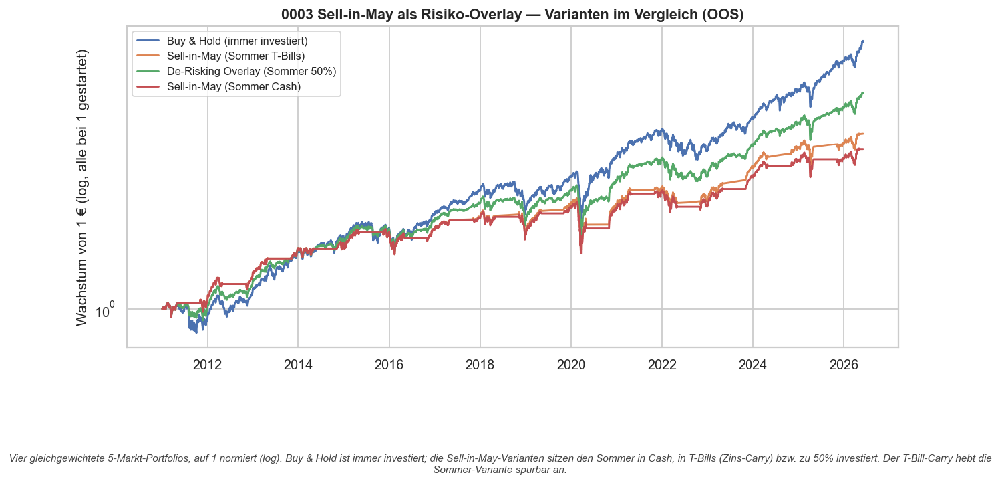
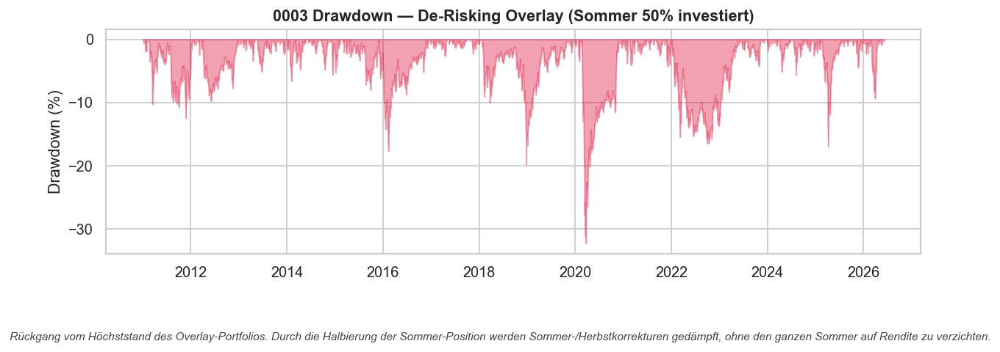

# Strategie 0003 — Sell-in-May als Risiko-Overlay (T-Bill-Carry & Teil-De-Risking)

- **Kategorie:** seasonal
- **Status:** Risiko-Overlay (kein eigenständiger Renditevorteil) — De-Risking-Variante ist der beste Kompromiss
- **Datum:** 2026-06-03
- **Universum:** S&P 500 (USA), Nasdaq 100 (USA), DAX (Deutschland),
  FTSE 100 (UK), Nikkei 225 (Japan)
- **Stichprobe:** Out-of-Sample 2011–2026 (netto nach Kosten)

## 1. Motivation (folgt aus Strategie 0002)

0002 hat gezeigt: Gepooltes Sell-in-May **schlägt Buy & Hold nicht** bei der
Rendite, senkt aber die Volatilität. Der Effekt ist also kein Alpha, sondern ein
**Risiko-Werkzeug**. Diese Strategie testet zwei konkrete Verbesserungen — beide
als gleichgewichtete 5-Markt-Portfolios:

1. **T-Bill-Carry:** Statt den Sommer (Mai–Okt) in *Cash* zu sitzen, das Geld in
   kurzlaufende US-Staatsanleihen parken (^IRX, 13-Wochen-T-Bill-Rendite).
   Schließt der Zins-Carry die Renditelücke zu Buy & Hold?
2. **De-Risking-Overlay:** Im Sommer nicht voll auf Cash gehen, sondern zu **50%
   investiert** bleiben — die Hälfte des Sommer-Aufwärts mitnehmen, aber das
   Sommerrisiko trotzdem reduzieren.

## 2. Verglichene Varianten

Alle gleichgewichtet über die fünf Märkte, netto nach IBKR-Kosten:

- **Buy & Hold** — immer 100% investiert (Benchmark)
- **Sell-in-May (Sommer Cash)** — Winter 100%, Sommer 0% (= Strategie 0002)
- **Sell-in-May (Sommer T-Bills)** — Winter 100%, Sommer in ^IRX
- **De-Risking-Overlay** — Winter 100%, Sommer 50%

## 3. Ergebnis (Out-of-Sample, netto)

| Variante                        |  CAGR | Sharpe | Sortino | Volatilität | Max DD | Calmar |
| ------------------------------- | ----: | -----: | ------: | ----------: | -----: | -----: |
| Buy & Hold (immer investiert)   | 13.6% |   0.83 |    1.03 |       14.2% | -32.4% |   0.42 |
| De-Risking Overlay (Sommer 50%) | 10.8% |   0.77 |    0.92 |       11.6% | -32.4% |   0.33 |
| Sell-in-May (Sommer T-Bills)    |  8.7% |   0.66 |    0.76 |       10.6% | -32.4% |   0.27 |
| Sell-in-May (Sommer Cash)       |  7.9% |   0.59 |    0.75 |       10.6% | -32.4% |   0.24 |

**Was der T-Bill-Carry bringt:** Er hebt die Sommer-Variante spürbar an — CAGR von
7,9% → **8,7%** und Sharpe von 0,59 → **0,66**, ohne zusätzliches Risiko. Aber er
**schließt die Lücke zu Buy & Hold nicht** (8,7% vs. 13,6%): Der Zins auf
T-Bills ist deutlich kleiner als die Aktienrendite, die man im Sommer aufgibt.

**Was der De-Risking-Overlay bringt:** Mit nur halber Sommer-Position ist er der
**beste risikoadjustierte Kompromiss** — CAGR **10,8%** bei Sharpe **0,77**, also
sehr nah an Buy & Hold (0,83), aber mit klar niedrigerer Volatilität (11,6% statt
14,2%). Wer bewusst weniger Schwankung will, gibt hier nur wenig Sharpe auf.

**Wichtige Einschränkung:** Der maximale Drawdown ist bei **allen** Varianten
identisch (-32,4%). Der große Rückgang fiel 2022 ins **Winterhalbjahr** — also
genau dann, wenn alle Varianten voll investiert sind. Das Aussitzen des Sommers
schützt nicht vor jedem Crash; es senkt die laufende Volatilität, nicht den
schlimmsten Einzelverlust.

## 4. Pro-Markt (T-Bill-Variante)

| Markt              | Sharpe |  CAGR | Trades |
| ------------------ | -----: | ----: | -----: |
| S&P 500 (USA)      |   0.51 |  8.2% |     16 |
| Nasdaq 100 (USA)   |   0.50 |  9.1% |     16 |
| DAX (Deutschland)  |   0.50 |  8.4% |     16 |
| FTSE 100 (UK)      |   0.29 |  4.8% |     16 |
| Nikkei 225 (Japan) |   0.38 |  7.0% |     16 |

## 5. Signifikanz

Die eigentliche Timing-Wette wurde bereits in 0002 getestet und ist **nicht
signifikant** (Permutationstest p = 0,33, Deflated Sharpe ≈ 0, konsistent mit
0002). T-Bill-Carry und De-Risking sind **Risiko-Konstruktion auf demselben,
nicht signifikanten Timing** — ein neuer Signifikanztest gegen Zufalls-Timing ist
für sie nicht aussagekräftig. Diese Strategie liefert also keinen statistischen
Edge, sondern beantwortet eine **Konstruktionsfrage**: Wie setzt man den Sommer
am besten um, wenn man den Effekt als Risiko-Overlay nutzt?

## 6. Visualisierungen

## 7. Verdict

**Der De-Risking-Overlay ist die beste Umsetzung.** Er holt fast den gesamten
risikoadjustierten Ertrag von Buy & Hold (Sharpe 0,77 vs. 0,83) bei rund **18%
weniger Volatilität** — ein sinnvolles Profil für einen risikoaverseren Anleger.
Der reine T-Bill-Carry verbessert die Cash-Variante zwar, bleibt aber deutlich
hinter Buy & Hold; den Sommer komplett auszusitzen kostet zu viel Aktienrendite.

**Kein zusätzliches Alpha:** Auf reiner Sharpe-Basis schlägt **keine** Variante
Buy & Hold. Der Sell-in-May-Effekt bleibt damit über alle drei Strategien
(0001–0003) hinweg ein **Volatilitäts-/De-Risking-Werkzeug**, keine Renditequelle.

**Nächste Schritte:** (a) den Overlay als steuerbares Vola-Ziel formulieren
(Sommer-Gewicht aus der jüngsten Volatilität ableiten statt fix 50%); (b) den
Ansatz auf ein anderes Asset mit echtem saisonalem Angebots-/Nachfrage-Treiber
übertragen — z.B. Erdgas-Winternachfrage — wo eine fundamentale Ursache einen
echten Edge plausibler macht als bei breiten Aktienindizes.

### Artefakte
`results/metrics.json`, `results/per_market_panel.csv`, `results/equity.csv`,
`results/card.json`, `results/plots/{variants_equity,drawdown_overlay}.png`
