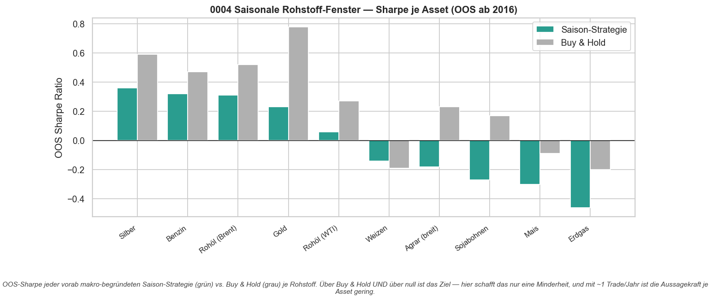
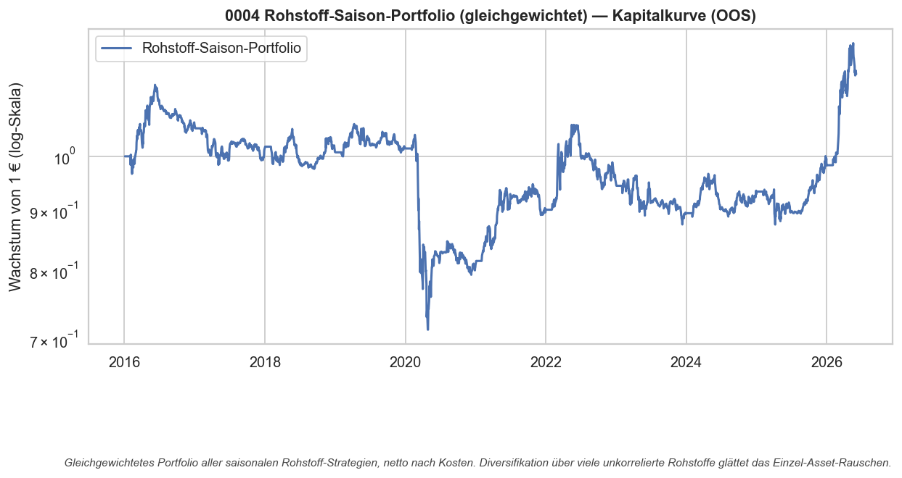

# Strategie 0004 — Saisonale Rohstoff-Fenster (breiter Screen, Seasonax-Idee, ehrlich getestet)

- **Kategorie:** seasonal
- **Status:** abgelehnt (rejected) — kein saisonales Rohstoff-Fenster schlägt Buy & Hold mit Signifikanz, netto nach echten ETF-Kosten
- **Datum:** 2026-06-03
- **Universum:** Erdgas, Rohöl (WTI), Benzin, Rohöl (Brent), Gold, Silber,
  Mais, Weizen, Sojabohnen, Agrar (breit) — jeweils über handelbare US-ETFs
- **Stichprobe:** Out-of-Sample ab 2016 (frühe ETF-Jahre nur als Kontext), netto nach IBKR-Kosten

## 1. Hypothese

Rohstoffe haben — anders als breite Aktienindizes (0001–0003) — einen **realen,
physischen** Saison-Treiber (Heizsaison, Fahrsaison, Aussaat-/Wetterrisiko). Wenn
es irgendwo einen echten Kalender-Edge gibt, dann am ehesten hier. Pro Asset wird
**ein vorab makro-begründetes Long-Fenster** getestet (eine Hypothese pro Asset),
ganz im Geist kommerzieller Tools wie **Seasonax** — aber mit ehrlicher
Kostenrechnung, Permutationstest und einer Deflated Sharpe über den gesamten
Screen.

## 2. Makro-Begründung

Jedes Fenster folgt einem Angebots-/Nachfrage-Zyklus, **nicht** dem Kurs:

- **Erdgas (Sep–Dez):** Heizsaison, Lagerabbau in den Winter.
- **Rohöl WTI/Brent & Benzin (Feb–Mai):** Vorlauf zur US-Sommer-Fahrsaison.
- **Gold & Silber (Aug–Dez):** indische Hochzeits-/Diwali- und chin. Neujahrsnachfrage.
- **Mais/Weizen/Soja/Agrar (Frühjahr–Frühsommer):** Aussaat- und Wetter-Risikoprämie.

Weil die Fenster **vorab** aus der Fundamentalursache feststehen, gibt es keine
In-Sample-Selektionsverzerrung auf dem Fenster selbst — der Test ist fair.

## 3. Regeln

Long (Gewicht 1.0) während der vorab definierten Kalendermonate, sonst flat. Ein
Asset = eine Hypothese. Signale sind Entscheidungszeit-Signale; die Engine
verzögert sie (`.shift(1)`), kein Look-Ahead. ~1 Trade/Asset/Jahr → bewusst
geringe statistische Power je Einzel-Asset (deshalb zusätzlich ein
gleichgewichtetes Portfolio).

## 4. Kosten- & Ausführungsannahmen

IBKR-Standardmodell (`IBKR_DEFAULT`): gestaffelte Kommission, 3 bps Slippage,
Regulierungsgebühren. Bewertet werden **handelbare ETFs** — also inklusive
Roll-/Contango-Verlusten der Rohstoff-Futures, die jeder reale Trader trägt. Das
ist der ehrlichere Test als idealisierte Futures-Kurven.

## 5. Ergebnisse — Per-Asset-Screen (Out-of-Sample ab 2016, netto)

| Rohstoff      | Fenster (Monate) | Saison-Sharpe | B&H-Sharpe |   CAGR | Max DD | Trefferquote | Trades | Perm-p |
| ------------- | ---------------: | ------------: | ---------: | -----: | -----: | -----------: | -----: | -----: |
| Silber        |     8/9/10/11/12 |          0.36 |       0.59 |   7.2% | -26.7% |          70% |     10 |   0.44 |
| Benzin        |          2/3/4/5 |          0.32 |       0.47 |   7.1% | -73.0% |          55% |     11 |   0.36 |
| Rohöl (Brent) |          2/3/4/5 |          0.31 |       0.52 |   6.8% | -71.3% |          55% |     11 |   0.40 |
| Gold          |     8/9/10/11/12 |          0.23 |       0.78 |   3.7% | -17.6% |          70% |     10 |   0.73 |
| Rohöl (WTI)   |          2/3/4/5 |          0.06 |       0.27 |  -0.9% | -83.8% |          55% |     11 |   0.58 |
| Weizen        |          3/4/5/6 |         -0.14 |      -0.19 |  -2.2% | -41.5% |          46% |     11 |   0.42 |
| Agrar (breit) |          3/4/5/6 |         -0.18 |       0.23 |  -0.1% | -27.0% |          55% |     11 |   0.71 |
| Sojabohnen    |          4/5/6/7 |         -0.27 |       0.17 |  -1.7% | -32.4% |          55% |     11 |   0.81 |
| Mais          |          3/4/5/6 |         -0.30 |      -0.09 |  -2.9% | -36.9% |          18% |     11 |   0.71 |
| Erdgas        |       9/10/11/12 |         -0.46 |      -0.20 | -16.9% | -92.8% |          30% |     10 |   0.89 |

**Kein einziges** Saison-Fenster schlägt sein eigenes Buy & Hold. Die besten
(Silber, Benzin, Brent) liegen alle **unter** B&H und haben einen
Permutations-p-Wert von 0,36–0,44 — also klar nicht von Zufalls-Timing
unterscheidbar. Kein Asset erreicht p < 0,10.

### Gleichgewichtetes Rohstoff-Saison-Portfolio

| Kennzahl              |     Wert |
| --------------------- | -------: |
| CAGR                  |     1,6% |
| Sharpe                |     0,01 |
| Sortino               |     0,01 |
| Volatilität           |    10,4% |
| Max Drawdown (Dauer)  | -38,0% (2.456 Tage) |
| Perioden              |    2.619 |

Die Diversifikation über zehn Rohstoffe glättet das Einzel-Rauschen — und legt
genau dadurch offen, dass **netto kein Edge übrig bleibt**: Sharpe praktisch null.

## 6. Signifikanz

| Test                          |              Wert |
| ----------------------------- | ----------------: |
| Permutationstest p-Wert       |              0,43 |
| Bootstrap Sharpe 95%-KI       |   [-0,59, +0,61]  |
| Deflated Sharpe (10 Varianten)|             0,000 |

Der Permutationstest (p = 0,43) kann das Portfolio nicht von Zufalls-Timing
trennen. Das Bootstrap-KI umschließt symmetrisch die Null. Die **Deflated Sharpe
ist exakt 0** — selbst wenn ein Fenster gut ausgesehen hätte, würde die Korrektur
für **10 gleichzeitig getestete Hypothesen** es vollständig wegerklären. Die
erwartete Maximal-Sharpe unter reinem Zufall (≈ 1,57 annualisiert über 10
Versuche) liegt weit über allem, was wir beobachtet haben.

## 7. Robustheit

Über zehn unkorrelierte Rohstoffe und vier Sektoren (Energie, Edelmetall, Agrar)
ist das Ergebnis **einheitlich negativ**. Es gibt keinen Sektor, der den Effekt
trägt. Das ist robust — robust *dagegen*, dass ein handelbarer Saison-Edge
existiert.

## 8. Verdict

**Abgelehnt.** Die in Seasonax-artigen Tools beworbenen Rohstoff-Saisonmuster
überleben den ehrlichen Test nicht: netto nach realen ETF-Kosten, gegen
Zufalls-Timing und korrigiert für Mehrfach-Testing bleibt **kein** verwertbarer
Edge.

**Die Lehre — Erdgas:** Genau der Kandidat mit der stärksten Fundamentalstory
(Heizsaison) ist mit Abstand der **schlechteste** (Sharpe -0,46, CAGR -16,9%, Max
DD -92,8%). Das Saisonmuster *existiert* im Future — aber der handelbare ETF (UNG)
verliert permanent durch **Contango/Roll-Decay**: Beim monatlichen Rollen wird
teurer zurückgekauft, was gerollt wird. Ein im Future sichtbares Muster ist also
nicht automatisch handelbar. Genau deshalb testen wir handelbare ETFs und nicht
idealisierte Future-Kurven.

**Konsequenz:** Saisonalität bleibt über alle vier Strategien (0001–0004) hinweg
**kein eigenständiger Renditeedge** — auf Aktienindizes ein Risiko-/Vola-Werkzeug
(0003), auf Rohstoffen netto wertlos. Nächster sinnvoller Schritt: weg von reinem
Kalender-Timing, hin zu Ansätzen mit messbarem ökonomischem Zustand (z.B.
Cross-Asset-Momentum oder Mean-Reversion mit echtem Trade-Volumen).

## 9. Visualisierungen

### Artefakte
`results/metrics.json`, `results/screen_panel.csv`, `results/equity.csv`,
`results/card.json`, `results/plots/{sharpe_by_asset,portfolio_equity}.png`
