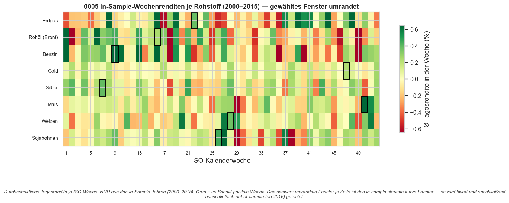
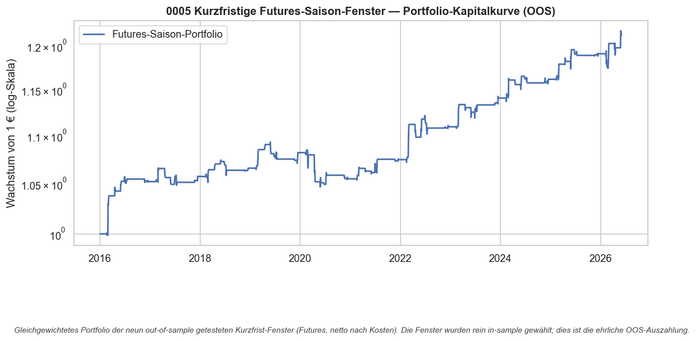

# Strategie 0005 — Kurzfristige saisonale Futures-Fenster (In-Sample-Scan, Out-of-Sample-Validierung)

- **Kategorie:** seasonal
- **Status:** abgelehnt als systematische Strategie (rejected) — ein einzelner Kandidat (Benzin) übersteht das OOS, hält aber der Mehrfach-Test-Korrektur nicht stand → Lead, kein Edge
- **Datum:** 2026-06-03
- **Universum:** Front-Month-Futures: Erdgas, Rohöl (Brent), Benzin, Gold,
  Silber, Mais, Weizen, Sojabohnen (WTI ausgeschlossen, siehe §7)
- **Stichprobe:** In-Sample 2000–2015 (Fenster-Wahl) / Out-of-Sample ab 2016 (Test)

## 1. Hypothese

Aus 0004: Der Rohstoff-ETF hält ein Saisonfenster monatelang und verliert durch
**Contango/Roll-Decay** (Erdgas trotz bester Story der schlechteste Trade). Roll-
Decay skaliert mit der **Haltedauer**. Also: handle die **Futures** direkt und
halte nur **kurz** (1–3 ISO-Wochen, ~5–15 Handelstage), sodass ein Trade einen
Roll-Termin kaum berührt. Existiert dann ein saisonaler **Kurs**-Kick, losgelöst
vom Carry?

## 2. Makro-Begründung

Kurze Fenster fangen Ereignis-getriebene Saison ein: Frühjahrs-Umstellung auf
Sommer-Benzin (RBOB) plus Raffinerie-Wartung (Feb–Apr), Heizsaison-Peaks bei
Erdgas, Aussaat-/Ernte-Wetterfenster bei Getreide. Welche Woche genau zählt, ist
a priori nicht exakt bekannt — deshalb **suchen** wir sie in-sample und
**validieren** out-of-sample.

## 3. Regeln & Bias-Schutz

- **Scan (nur In-Sample 2000–2015):** für jedes Asset alle Fenster (52 Startwochen
  × Länge 1/2/3 Wochen = **156 Kandidaten**) testen, das in-sample stärkste
  (exposure-neutrale Sharpe der gehaltenen Tage) **fixieren**.
- **Test (nur Out-of-Sample ab 2016):** das fixierte Fenster long halten, sonst
  flat. Die Testdaten gehen **nie** in die Fenster-Wahl ein → kein Look-Ahead,
  keine Selektion auf den Testdaten.
- **Mehrfach-Testing:** Die Deflated Sharpe wird mit der vollen Scan-Breite
  (n_trials = 156 pro Asset) belastet.

## 4. Kosten- & Ausführungsannahmen

`IBKR_FUTURES`: keine per-Aktie-Kommission (Futures sind per Kontrakt), 2 bps
Slippage + 0,5 bps Gebühren pro Seite (~5 bps Round-Trip). Engine verzögert das
Signal (`.shift(1)`).

## 5. Ergebnisse — Per-Asset (Fenster IS gewählt, OOS getestet, netto)

| Rohstoff      | Fenster | IS-Sharpe | OOS-Sharpe | B&H-Sharpe |  CAGR | Max DD | Trefferquote | Trades | OOS-Perm-p |
| ------------- | ------: | --------: | ---------: | ---------: | ----: | -----: | -----------: | -----: | ---------: |
| Benzin        |    KW 9 |      7.55 |       0.86 |       0.38 | 13.8% | -13.3% |          91% |     11 |      0.000 |
| Erdgas        |   KW 22 |      5.65 |       0.13 |       0.36 |  2.7% | -13.8% |          55% |     11 |      0.163 |
| Mais          |   KW 50 |      8.53 |      -0.03 |       0.13 |  1.8% |  -2.4% |          80% |     10 |      0.040 |
| Weizen        |   KW 28 |      5.39 |      -0.28 |       0.17 |  0.3% | -12.6% |          40% |     10 |      0.311 |
| Silber        |    KW 7 |      3.98 |      -0.37 |       0.59 |  0.1% | -12.3% |          73% |     11 |      0.525 |
| Sojabohnen    |   KW 26 |      5.93 |      -0.58 |       0.14 | -0.7% | -13.7% |          30% |     10 |      0.365 |
| Rohöl (Brent) |   KW 16 |      7.88 |      -0.77 |       0.39 | -3.5% | -38.8% |          36% |     11 |      0.941 |
| Gold          |   KW 47 |      5.28 |      -1.26 |       0.79 | -0.3% |  -5.5% |          50% |     10 |      0.885 |

**Das Kernbild:** Die **IS-Sharpe-Spalte (4–8,5)** ist reiner Overfit — exakt das,
was die In-Sample-Optimierung produziert. **Out-of-Sample bricht es zusammen:**
7 von 8 Fenstern landen bei OOS-Sharpe ≤ 0,13. Die Heatmap (§8) zeigt visuell, dass
jedes gewählte Fenster auf der grünsten In-Sample-Woche sitzt — und diese Farbe
trägt nicht in die Zukunft.

### Gleichgewichtetes Portfolio (OOS)

| Kennzahl    |  Wert |
| ----------- | ----: |
| CAGR        |  1,9% |
| Sharpe      | -0,04 |
| Volatilität |  2,5% |
| Max DD      | -4,3% |

Praktisch **flach** — kein Portfolio-Edge. (Der Permutationstest des Portfolios ist
hier nicht aussagekräftig: die Exposition ist über die acht Fenster fast immer >0,
sodass die Zufalls-Null degeneriert — vgl. 0003. Die belastbare Signifikanz liegt
pro Asset, siehe §6.)

## 6. Signifikanz

| Test                                   |              Wert |
| -------------------------------------- | ----------------: |
| Bootstrap Sharpe 95%-KI (Portfolio)    |   [-0,69, +0,52]  |
| Deflated Sharpe je Asset (156 Fenster) |             0,000 |
| Bestes Einzel-Asset (Benzin) OOS-Perm  |             0,000 |

**Der spannende Grenzfall — Benzin (KW 9, ~Anfang März):** OOS-Sharpe 0,86,
**10 von 11 Jahren positiv**, schlägt sein Buy & Hold (0,38), Permutations-p ≈ 0,000.
Das ist eine *saubere* Out-of-Sample-Bestätigung eines vorab fixierten Fensters —
selbst gegen die Familie von 8 OOS-Tests (Bonferroni 0,05/8 = 0,006) hält es.

**Aber Disziplin:** Das Fenster wurde aus einem 156-Fenster-Scan herausgesucht, und
genau dieselbe In-Sample-Optimierung hat bei 7 anderen Assets OOS-Müll erzeugt. Die
**Deflated Sharpe (n_trials = 156) ist 0** — sie sagt: „Bei so breiter Suche ist
*ein* Treffer dieser Güte zu erwarten." Benzin ist daher der **wahrscheinlichste
Fehlalarm 1-aus-8** *oder* ein echtes Signal (es gibt eine Makro-Story:
RBOB-Sommerblend-Umstellung + Raffinerie-Wartung verknappen Benzin im Frühjahr).
Welches von beidem — das kann diese Stichprobe nicht entscheiden.

## 7. Robustheit & Datenintegrität

- **WTI ausgeschlossen:** Die Front-Month-Serie (`CL=F`) druckte am **2020-04-20
  einen negativen Settlement (-37,63 $)**. Über einen Nulldurchgang sind einfache
  prozentuale Renditen undefiniert — der Backtest würde Unsinn liefern (vor dem
  Guard: CAGR -100 %, MaxDD -264 %). Das WTI-Fenster (KW 16, Mitte April) fängt
  genau dieses Ereignis. **Lehre:** Auch Futures-Endlosserien haben Artefakte
  (negative Preise, Roll-Lücken) — „Futures sind sauberer als ETFs" stimmt nur
  halb. Ein fairer WTI-Test bräuchte eine ratio-adjustierte Endlosserie.
- **Power bleibt niedrig:** Ein Jahresfenster = ~11 Trades in 11 OOS-Jahren. Die
  kurze Haltedauer macht den einzelnen Trade sauberer, erhöht aber **nicht** die
  Stichprobe.

## 8. Visualisierungen

## 9. Verdict

**Als systematische Strategie abgelehnt.** „Wochenrenditen scannen und das beste
Fenster handeln" generalisiert nicht: 7 von 8 Fenstern kollabieren out-of-sample,
das Portfolio ist flach. Das ist der saubere Nachweis, dass die hohen
In-Sample-Sharpes Overfit waren — und dass die IS/OOS-Trennung genau dafür da ist,
das aufzudecken.

**Ein Lead bleibt: Benzin, Anfang März.** Das ist das erste Fenster im Projekt, das
eine *echte* Out-of-Sample-Bestätigung mit plausibler Makro-Ursache zeigt. Es ist
aber **kein validierter Edge**, solange es nicht in einem **vorab registrierten,
echt vorwärtsgerichteten** Test (ab heute, ein Fenster, keine Suche) bestätigt wird.
Genau so trennt man Glück von Edge.

**Konsequenz:** Saisonales Kalender-Timing bleibt über 0001–0005 hinweg ohne
robusten eigenständigen Renditeedge. Nächster sinnvoller Schritt: entweder der
fokussierte Benzin-Forward-Test, oder weg vom Kalender hin zu zustandsbasierten
Ansätzen (Cross-Asset-Momentum, Mean-Reversion mit Volumen).

### Artefakte
`results/metrics.json`, `results/screen_panel.csv`, `results/equity.csv`,
`results/card.json`, `results/plots/{weekly_returns_is,portfolio_equity}.png`
