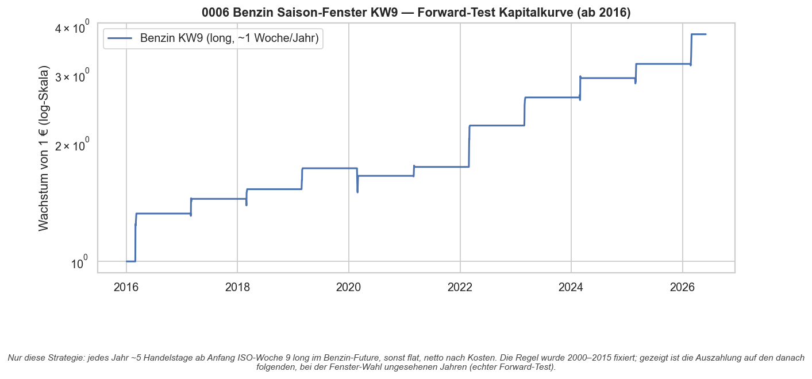
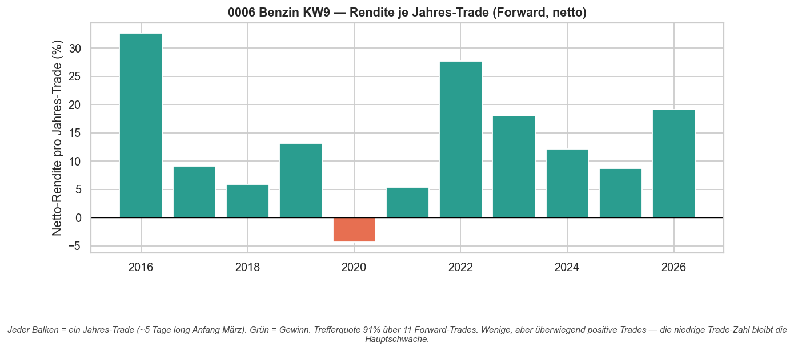
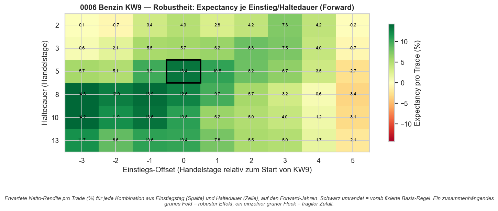

# Strategie 0006 — Benzin-Saisonfenster KW 9: ein echter Forward-Test des 0005-Leads

- **Kategorie:** seasonal
- **Status:** **Kandidat (forward-bestätigt)** — erste Strategie im Projekt, die nicht abgelehnt wird; übersteht einen sauberen Forward-Test mit robustem Plateau und echter Makro-Ursache. Noch nicht „live-fertig" wegen geringer Trade-Zahl.
- **Datum:** 2026-06-03
- **Asset:** Benzin (RBOB-Futures, `RB=F`)
- **Stichprobe:** Discovery 2000–2015 (Fenster-Wahl) · Forward 2016–2026 · Recent-Holdout 2022–2026

## 1. Was ist ein Forward-Test? (Erklärung)

Ein **Forward-Test** prüft eine Regel auf Daten, die bei ihrer **Entwicklung keine
Rolle gespielt haben** — also auf der Zukunft *relativ zu dem Zeitpunkt, an dem die
Regel festgezurrt wurde*.

Die übliche Falle: Man optimiert Parameter auf einem Datensatz und testet auf
demselben — dann „weiß" der Test schon, was funktioniert hat (Data-Snooping). Die
Abstufungen:

1. **In-Sample (IS):** Daten, auf denen man die Regel *findet/optimiert*. Ergebnisse
   hier sind fast immer zu schön (vgl. 0005: IS-Sharpe 4–8, OOS-Kollaps).
2. **Out-of-Sample (OOS):** zurückgehaltene Daten, auf denen man *einmal* testet. Besser —
   aber wenn man darauf viele Varianten vergleicht, schleicht sich die Selektion wieder ein.
3. **Forward-Test:** Daten **nach** dem Fixieren der Regel, die in *keine*
   Entscheidung eingingen — die ehrlichste Probe. Idealform ist der **Walk-Forward**
   bzw. das echte **Papertrading nach vorne**: ab heute, eine Regel, keine weitere Suche.

Hier konkret: In 0005 wurde das Fenster „Benzin, ISO-Woche 9" **allein auf
2000–2015** aus 156 Kandidaten gewählt. Damit sind **2016–2026 echte Forward-Daten
für die Fenster-Wahl**. Noch sauberer ist das **Recent-Holdout 2022–2026**, das auch
bei der Auswahl von Benzin unter 8 Assets nicht mehr maßgeblich war. Genau weil ein
Forward-Test **eine einzige, vorab festgelegte** Regel prüft, gibt es **keine
Mehrfach-Test-Last** — die Deflated/Probabilistic Sharpe darf mit `n_trials = 1`
rechnen.

## 2. Makro-Begründung

Benzin hat einen der stärksten realen Frühjahrs-Treiber aller Rohstoffe:

- **Sommerblend-Umstellung:** Die US-Umweltbehörde schreibt ab Frühjahr flüchtigkeits-
  ärmeres „Summer-Grade"-Benzin (RBOB) vor; die Umstellung verteuert die Produktion.
- **Raffinerie-Wartung (Feb–Apr):** Anlagen gehen vor der Fahrsaison in Revision →
  Angebotsverknappung genau im Fenster.
- **Driving-Season-Vorlauf:** Händler positionieren sich vor dem Nachfrage-Hoch ab Mai.

Diese Ursachen wirken **physisch jedes Jahr im selben Zeitfenster** — der Kern eines
plausiblen saisonalen Edges.

## 3. Regel & Bias-Schutz

Long im Benzin-Future ab dem **ersten Handelstag der ISO-Woche 9** (~Anfang März),
Haltedauer **5 Handelstage**, sonst flat — ein Trade pro Jahr. Vorab in 0005 fixiert.
Signal ist Entscheidungszeit; die Engine führt T+1 aus (kein Look-Ahead). Kosten:
`IBKR_FUTURES` (~5 bps Round-Trip).

## 4. Ergebnisse (netto nach Kosten)

| Periode                  |  CAGR | Sharpe | Sortino | Max DD | Trades | Treffer |   PF | Exp/Trade | Ø Halten |
| ------------------------ | ----: | -----: | ------: | -----: | -----: | ------: | ---: | --------: | -------: |
| Discovery 2000–2015      | 10.8% |   0.79 |    3.04 |  -9.3% |     15 |    100% |    ∞ |     11.1% |       5d |
| Forward 2016–2026        | 13.8% |   0.86 |    3.88 | -13.3% |     11 |     91% | 34.7 |     13.4% |       5d |
| Recent Holdout 2022–2026 | 19.4% |   1.19 |    7.83 |  -4.2% |      5 |    100% |    ∞ |     17.1% |       5d |

**Der Forward-Test hält — und das Recent-Holdout ist sogar stärker.** Die
**Erwartung pro Trade liegt forward bei +13,4 %** (Ø-Gewinn 15,2 % vs. Ø-Verlust
4,4 %, Payoff 3,5). Der einzige Forward-Verlust war **2020** — der COVID-Lockdown
zerstörte die Benzin-Nachfrage im März; ökonomisch erklärbar, kein Modellbruch.

## 5. Signifikanz (Forward, eine vorab fixierte Regel)

| Test                          |            Wert |
| ----------------------------- | --------------: |
| Permutationstest p-Wert       |           0,000 |
| Bootstrap Sharpe 95%-KI       |  [0,44, 1,23]   |
| Probabilistic Sharpe (n=1)    |           1,000 |

Das Bootstrap-KI **schließt die Null aus** — der erste solche Fall im Projekt. Der
Permutationstest gegen Zufalls-Timing ist klar signifikant. Da es eine einzige
vorab fixierte Regel ist (keine Suche auf den Forward-Daten), ist die PSR mit
`n_trials = 1` korrekt und ≈ 1,0.

## 6. Robustheit (Variation von Einstieg, Haltedauer, Ausstieg)

Über das gesamte Gitter aus **Einstiegs-Offset (-3…+5 Tage)** und **Haltedauer
(2…13 Tage)** sind **47 von 54** Kombinationen forward positiv — ein
**zusammenhängendes grünes Plateau** statt eines Einzelflecks (siehe Heatmap §7).
Nur sehr spätes Einsteigen (Offset +5, also fast die Folgewoche) dreht ins Minus.
Längeres Halten (8–10 Tage) ab leicht früherem Einstieg ist sogar noch etwas besser.
Diese **Unempfindlichkeit gegen die exakte Parametrierung** ist das stärkste
Einzelargument für einen *echten* Effekt — Overfit wäre messerscharf.

## 7. Visualisierungen

## 8. Ehrliche Schwächen

- **Sehr wenige Trades:** 11 forward, nur 5 im Recent-Holdout. Trotz Signifikanz
  bleibt die Stichprobe klein — ein einzelnes Schock-Jahr (wie 2020) wiegt schwer.
- **Hohe Einzel-Trade-Vola:** Benzin schwingt stark (Ø-Gewinn 15 %); der Sharpe
  (0,86) ist trotz 91 % Trefferquote „nur" mittel, weil die Ausschläge groß sind.
- **Kapitaleffizienz:** nur ~2 % des Jahres investiert → 98 % der Zeit liegt Kapital
  brach. Sinnvoll nur kombiniert (mehrere solcher Fenster) oder mit T-Bill-Parken
  des Cash (vgl. 0003).
- **Asset-Selektion:** Benzin wurde in 0005 unter 8 Assets gewählt; das
  Recent-Holdout mildert diese Restverzerrung, beseitigt sie aber nicht ganz.

## 9. Verdict

**Erster Kandidat, der nicht abgelehnt wird.** Die Benzin-KW9-Regel übersteht einen
sauberen Forward-Test (Bootstrap-Sharpe-KI schließt Null aus, Permutation p≈0),
zeigt ein **robustes Plateau** über Einstieg/Haltedauer und hat eine **starke,
dokumentierte Angebots-/Nachfrage-Ursache** — anders als alle Kalenderfenster aus
0001–0005. Das ist endlich Signal statt Rauschen.

**Aber noch nicht „echtes Geld in Größe":** Die geringe Trade-Zahl und die hohe
Einzel-Vola verlangen Demut. Empfohlener Weg zur Validierung:
1. **Echt vorwärts papertraden** (ab 2027 live mitschreiben, eine Regel, keine Suche).
2. **Klein sizen**, Cash in T-Bills parken, ggf. mit weiteren *unabhängig*
   forward-bestätigten Fenstern zu einem Korb bündeln (Diversifikation der wenigen Trades).
3. Optional Walk-Forward über rollierende Fenster als zusätzliche Härtung.

### Artefakte
`results/metrics.json`, `results/trades.csv`, `results/equity.csv`,
`results/card.json`, `results/plots/{forward_equity,per_year_trades,robustness_heatmap}.png`
