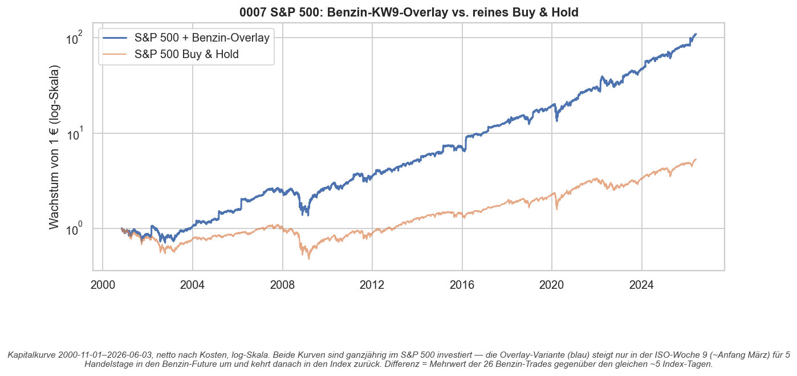
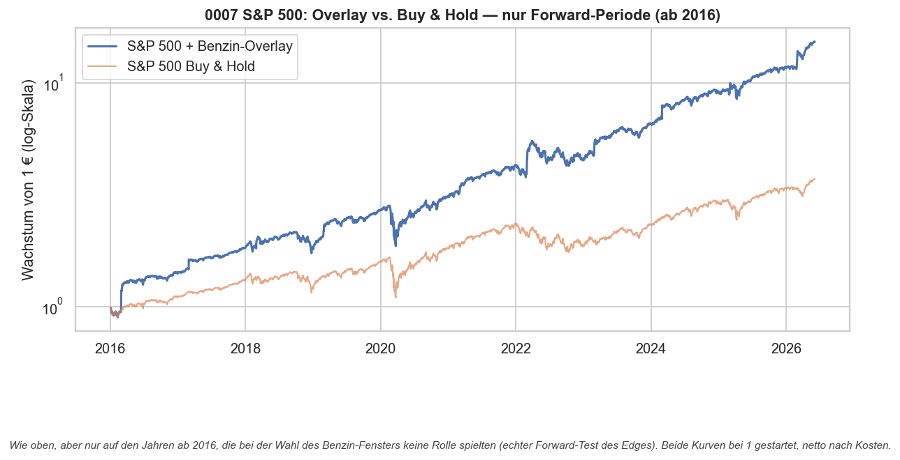
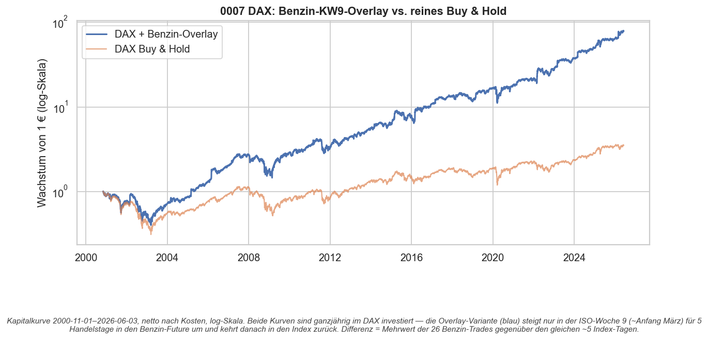
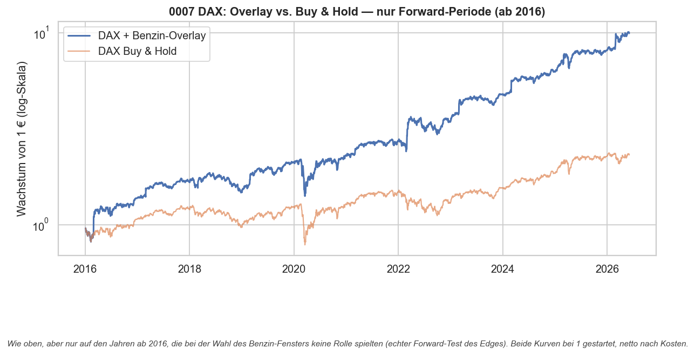

# Strategie 0007 — Benzin-KW9-Overlay auf einen Aktien-Index-Kern

- **Kategorie:** seasonal / overlay
- **Status:** **Kandidat (Overlay)** — löst die Kapitaleffizienz-Schwäche von 0006,
  schlägt reines Buy & Hold deutlich; die Größenordnung verlangt aber dieselbe
  Demut wie 0006 (wenige Trades, aggressive Notional-Annahme).
- **Datum:** 2026-06-03
- **Assets:** Benzin (RBOB-Futures, `RB=F`) + Aktien-Index-Kern (S&P 500 `^GSPC` / DAX `^GDAXI`)
- **Stichprobe:** gemeinsame Historie 2000-11 bis 2026-06 · Forward-Slice ab 2016

## 1. Die Idee

0006 ist nur ~2 % des Jahres investiert — **98 % der Zeit liegt das Kapital brach.**
Statt es als Cash zu halten, parkt dieses Overlay den Kern ganzjährig in einem
**breiten Aktien-Index** und steigt **nur in der ISO-Woche 9 (~Anfang März) für
5 Handelstage** in den Benzin-Future um. Danach zurück in den Index.

Die Frage ist also nicht „Benzin vs. nichts", sondern: **Lohnt es sich, jedes Jahr
~5 Index-Tage gegen den Benzin-Trade zu tauschen?** Die Equity-Kurve vergleicht
genau das gegen **reines Buy & Hold** des jeweiligen Index.

## 2. Mechanik & Bias-Schutz

- **Signal = Entscheidungszeit**, die Position wird um einen Tag verzögert gehalten
  (T+1-Ausführung) — kein Look-Ahead, identisch zu 0006.
- An jedem Tag mit aktivem Benzin-Signal verdient das Depot die **Benzin-Tagesrendite**,
  sonst die **Index-Tagesrendite**.
- **Umschaltkosten** werden bei jedem Ein- und Ausstieg berechnet: eine Futures-Seite
  (`IBKR_FUTURES`, ~2,5 bps) + eine Aktien-Seite (`IBKR_LIQUID_ETF`, ~2,2 bps).
  Zwei Umschaltungen pro Jahr → vernachlässigbar, aber modelliert. Alle Zahlen netto.

## 3. Ergebnisse (netto nach Kosten)

### S&P 500

| Periode             | Variante                | CAGR | Sharpe | Sortino | Vola | Max DD | Gesamtrendite |
| ------------------- | ----------------------- | ---: | -----: | ------: | ---: | -----: | ------------: |
| Voll 2000–2026      | **+ Benzin-Overlay**    | 20,2% |  0,84 |   1,23 | 22,6% | -48,6% |     10 799 % |
| Voll 2000–2026      | reines Buy & Hold       |  6,8% |  0,34 |   0,42 | 19,2% | -56,8% |        433 % |
| **Forward ab 2016** | **+ Benzin-Overlay**    | 30,0% |  1,20 |   1,76 | 22,3% | -34,1% |      1 420 % |
| **Forward ab 2016** | reines Buy & Hold       | 13,4% |  0,68 |   0,83 | 18,0% | -33,9% |        270 % |

### DAX

| Periode             | Variante                | CAGR | Sharpe | Sortino | Vola | Max DD | Gesamtrendite |
| ------------------- | ----------------------- | ---: | -----: | ------: | ---: | -----: | ------------: |
| Voll 2000–2026      | **+ Benzin-Overlay**    | 19,0% |  0,73 |   1,09 | 25,7% | -60,2% |      7 734 % |
| Voll 2000–2026      | reines Buy & Hold       |  5,1% |  0,25 |   0,33 | 22,7% | -69,1% |        251 % |
| **Forward ab 2016** | **+ Benzin-Overlay**    | 25,2% |  1,00 |   1,56 | 23,0% | -35,7% |        893 % |
| **Forward ab 2016** | reines Buy & Hold       |  8,5% |  0,42 |   0,54 | 18,9% | -38,8% |        131 % |

**Das Overlay schlägt reines Buy & Hold in jeder Periode und bei beiden Indizes
deutlich** — Sharpe rund verdoppelt, CAGR mehr als verdoppelt, und der Max-Drawdown
ist sogar **kleiner** (die großen Index-Crashs 2008/2020 lagen meist nicht in KW 9).
Der Benzin-Hebel kommt aus dem Aufzinsen: 26 Trades (96 % Treffer, ~12 % Erwartung
pro Trade) über die Historie, davon 11 im Forward-Slice.

## 4. Visualisierungen

## 5. Ehrliche Schwächen (wichtig)

- **Volle Historie enthält In-Sample-Jahre.** Das Fenster „KW 9" wurde 2000–2015
  gewählt; die Vollperioden-Zahlen sind daher teils in-sample geschönt. **Maßgeblich
  ist der Forward-Slice ab 2016** — der ist immer noch klar überlegen, aber das ist
  die ehrliche Headline.
- **Aggressive Notional-Annahme.** Das Modell schiebt **100 % des Index-Notionals**
  für 5 Tage in einen einzelnen Benzin-Future. Das ist eine konzentrierte Jahreswette;
  ein einziges Schock-Jahr (2020, COVID) trifft hart. In der Praxis hält man den Future
  auf Margin — man könnte den Index sogar behalten *und* die Benzin-Margin stellen
  (echtes Overlay statt Entweder-oder), oder kleiner sizen.
- **Wenige Trades bleiben wenige Trades.** Der gesamte Mehrwert ruht auf 11 Forward-Trades.
  Die Signifikanz des Edges stammt aus 0006; dieses Overlay *vergrößert* den Edge nicht,
  es nutzt nur das brachliegende Kapital.
- **Höhere Vola.** Das Overlay liegt ~3 Vol-Punkte über Buy & Hold — die Mehrrendite
  ist nicht „gratis", sie kommt mit den großen Benzin-Ausschlägen.

## 6. Verdict

**Die Idee funktioniert: das brachliegende 0006-Kapital im Index zu parken hebt CAGR
und Sharpe deutlich über reines Buy & Hold — forward-bestätigt für S&P 500 und DAX.**
Es ist die natürliche, kapitaleffiziente Verpackung des Benzin-Edges.

Aber es ist **kein neuer Edge**, sondern eine *Hebelung des 0006-Edges* über einen
Aktien-Kern; alle Vorbehalte von 0006 (geringe Trade-Zahl, Einzeljahr-Risiko) gelten
weiter, plus die aggressive Notional-Annahme. Sinnvoller nächster Schritt: das Overlay
**konservativer sizen** (z. B. nur 25–50 % Notional in Benzin, Rest im Index halten)
und weiter **forward papertraden**.

### Artefakte
`results/metrics.json`, `results/equity.csv`, `results/trades.csv`,
`results/card.json`, `results/plots/overlay_{gspc,gdaxi}{,_forward}.png`
