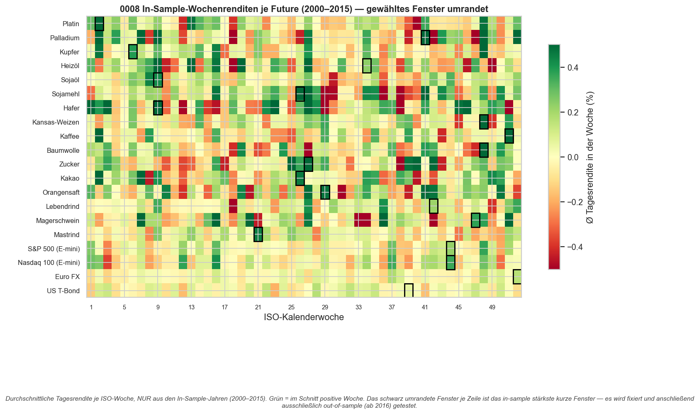
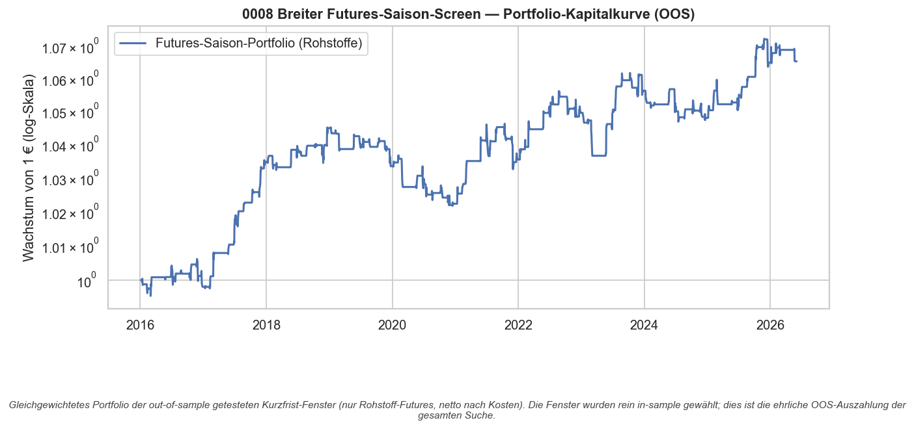

# Strategie 0008 — Breiter saisonaler Futures-Screen (IS-Scan, OOS-Validierung)

- **Kategorie:** seasonal
- **Status:** abgelehnt als systematische Strategie (rejected) — wie 0005; **ein**
  neuer Lead (Mastrind/Feeder Cattle, KW21) übersteht das OOS, hält aber der
  Mehrfach-Test-Korrektur nicht stand → Lead, kein Edge
- **Datum:** 2026-06-03
- **Universum:** 20 Front-Month-Futures, bewusst **neu** gegenüber 0005:
  Platin, Palladium, Kupfer, Heizöl, Sojaöl, Sojamehl, Hafer, Kansas-Weizen,
  Kaffee, Baumwolle, Zucker, Kakao, Orangensaft, Lebendrind, Magerschwein,
  Mastrind + 4 Nicht-Rohstoff-Kontrollen (S&P 500, Nasdaq 100, Euro FX, US-T-Bond)
- **Stichprobe:** In-Sample 2000–2015 (Fenster-Wahl) / Out-of-Sample ab 2016 (Test)

## 1. Hypothese

Benzin-KW9 (0005 → Forward-Test 0006) zeigte: Ein kurzes, makro-begründetes
Saisonfenster *kann* out-of-sample überleben. Frage: Ist Benzin ein Einzelfall,
oder finden sich mit **derselben disziplinierten Suche** weitere Rohstoffe mit
echtem Frühjahrs-/Ernte-/Heizsaison-Kurskick? Geprüft auf 20 frischen Futures.

## 2. Makro-Begründung

Jeder Rohstoff hat einen physischen Angebots-/Nachfrage-Saisontreiber: Aussaat-
und Erntefenster (Getreide/Softs), Heizsaison (Heizöl), Verarbeitungs-/Crush-
Zyklen (Soja), Vieh-Kalbungs- und Grillsaison-Nachfrage (Lebendvieh). Welche
Woche genau zählt, ist a priori nicht exakt bekannt → **in-sample suchen,
out-of-sample validieren**. Die 4 Finanz-Futures sind eine **Kontrolle**: Aktien,
FX und Zinsen haben kaum physische Saisonalität — finden wir dort „signifikante"
Fenster, fittet die Methode Rauschen.

## 3. Regeln & Bias-Schutz (identisch zu 0005)

- **Scan (nur IS 2000–2015):** je Asset alle Fenster (52 Startwochen × Länge
  1/2/3 = **156 Kandidaten**) testen, das in-sample stärkste (exposure-neutrale
  Sharpe der gehaltenen Tage) **fixieren**.
- **Test (nur OOS ab 2016):** fixiertes Fenster long, sonst flat. Testdaten gehen
  **nie** in die Fenster-Wahl ein → kein Look-Ahead, keine Selektion auf Testdaten.
- **Mehrfach-Testing:** Deflated Sharpe mit voller Scan-Breite (n_trials = 156/Asset).

## 4. Kosten- & Ausführungsannahmen

`IBKR_FUTURES`: per-Kontrakt statt per-Aktie, ~5 bps Round-Trip
(2 bps Slippage + 0,5 bps Gebühr pro Seite). Engine verzögert das Signal
(`.shift(1)`).

## 5. Ergebnisse — Per-Asset (Fenster IS gewählt, OOS getestet, netto)

Sortiert nach OOS-Sharpe. `is_sharpe` = In-Sample (Overfit-Referenz),
`oos_sharpe` = ehrliches Out-of-Sample.

| Future                | Kontrolle | Fenster | IS-Sharpe | OOS-Sharpe | B&H-Sharpe |   CAGR | Max DD | Trefferq. | Trades | OOS-Perm-p |
| --------------------- | :-------: | ------: | --------: | ---------: | ---------: | -----: | -----: | --------: | -----: | ---------: |
| Mastrind (Feeder)     |     –     |   KW 21 |      6.01 |   **0.52** |       0.35 |  5.5%  | -6.0%  |    91%    |     11 |  **0.000** |
| Heizöl                |     –     |   KW 34 |      2.56 |       0.20 |       0.45 |  2.7%  | -6.0%  |    80%    |     10 |      0.054 |
| Orangensaft           |     –     |   KW 29 |      4.76 |       0.04 |       0.19 |  2.1%  | -7.0%  |    60%    |     10 |      0.120 |
| Kupfer                |     –     |   KW 6  |      3.96 |      -0.08 |       0.49 |  1.6%  | -5.8%  |    64%    |     11 |      0.079 |
| Palladium             |     –     |   KW 41 |      4.13 |      -0.21 |       0.37 |  0.8%  | -15.3% |    60%    |     10 |      0.367 |
| Sojaöl                |     –     |   KW 9  |      4.91 |      -0.26 |       0.41 |  1.0%  | -9.0%  |    55%    |     11 |      0.256 |
| Platin                |     –     |   KW 2  |      8.31 |      -0.27 |       0.32 |  0.6%  | -9.9%  |    64%    |     11 |      0.364 |
| Kakao                 |     –     |   KW 26 |      5.74 |      -0.42 |       0.21 | -0.3%  | -19.0% |    60%    |     10 |      0.586 |
| Kansas-Weizen         |     –     |   KW 48 |      4.38 |      -0.44 |       0.19 | -0.1%  | -11.8% |    50%    |     10 |      0.451 |
| Sojamehl              |     –     |   KW 26 |      5.86 |      -0.47 |       0.12 | -0.3%  | -9.8%  |    50%    |     10 |      0.394 |
| Zucker                |     –     |   KW 27 |      5.72 |      -0.52 |       0.05 | -0.1%  | -10.7% |    40%    |     10 |      0.457 |
| Nasdaq 100            |     ✓     |   KW 44 |      5.04 |      -0.52 |       0.85 |  0.4%  | -8.2%  |    60%    |     10 |      0.479 |
| Baumwolle             |     –     |   KW 48 |      3.37 |      -0.54 |       0.13 |  0.2%  | -10.2% |    40%    |     10 |      0.482 |
| S&P 500               |     ✓     |   KW 44 |      3.80 |      -0.65 |       0.69 |  0.5%  | -5.0%  |    60%    |     10 |      0.386 |
| Kaffee                |     –     |   KW 51 |      5.66 |      -0.66 |       0.31 | -1.8%  | -23.0% |    50%    |     10 |      0.793 |
| Hafer                 |     –     |   KW 9  |      6.44 |      -0.73 |       0.25 | -2.1%  | -29.6% |    45%    |     11 |      0.891 |
| Lebendrind            |     –     |   KW 42 |      4.27 |      -0.87 |       0.27 | -0.1%  | -7.9%  |    40%    |     10 |      0.662 |
| Magerschwein          |     –     |   KW 47 |      5.73 |      -0.91 |       0.29 | -1.3%  | -18.7% |    30%    |     10 |      0.945 |
| US T-Bond             |     ✓     |   KW 39 |      4.65 |      -1.62 |      -0.44 | -0.4%  | -5.3%  |    30%    |     10 |      0.666 |
| Euro FX               |     ✓     |   KW 52 |      8.14 |      -2.17 |      -0.14 | -0.1%  | -2.9%  |    40%    |     10 |      0.502 |

**Das Kernbild — exakt wie 0005:** Die `is_sharpe`-Spalte (2,5–8,3) ist reiner
Overfit. **Out-of-Sample bricht es zusammen:** 19 von 20 Fenstern landen bei
OOS-Sharpe ≤ 0,20, 16 davon **negativ**. Die Methode „grünste In-Sample-Woche
handeln" generalisiert auch auf 20 neuen Futures nicht.

### Gleichgewichtetes Rohstoff-Portfolio (OOS, ohne Kontrollen)

| Kennzahl    |   Wert |
| ----------- | -----: |
| CAGR        |  0,6%  |
| Sharpe      | -1,18  |
| Volatilität |  1,2%  |
| Max DD      | -2,2%  |

Praktisch flach bis leicht negativ — **kein Portfolio-Edge**.

## 6. Signifikanz

| Test                                   |             Wert |
| -------------------------------------- | ---------------: |
| Bootstrap Sharpe 95%-KI (Portfolio)    | [-1,82, -0,54]   |
| Deflated Sharpe je Asset (156 Fenster) |            0,000 |
| Bestes Einzel-Asset (Mastrind) OOS-Perm|            0,000 |

**Der Grenzfall — Mastrind / Feeder Cattle (KW 21, ~Ende Mai):** OOS-Sharpe 0,52,
**10 von 11 Jahren positiv** (Trefferquote 91 %), schlägt sein Buy & Hold (0,35),
Permutations-p ≈ 0,000. Eine saubere OOS-Bestätigung eines vorab fixierten
Fensters mit plausibler Makro-Story: **Feeder Cattle** (Mastrinder, die zur
Sommerweide platziert werden) hat im **späten Frühjahr** Nachfragedruck — Beginn
der Weidesaison + Grillsaison-Nachfrage um Memorial Day (Ende Mai ≈ KW 21).

**Aber Disziplin (gleiche Logik wie Benzin in 0005):** Das Fenster stammt aus
einem 156-Fenster-Scan über 20 Assets. Bei dieser Suchbreite ist *ein* Treffer
dieser Güte rein zufällig zu erwarten — die **Deflated Sharpe (n_trials = 156)
ist 0**. Mastrind ist der **wahrscheinlichste Fehlalarm 1-aus-20** *oder* ein
echtes Signal. Diese Stichprobe kann es nicht entscheiden.

## 7. Robustheit & Kontroll-Check

- **Kontroll-Futures sauber:** Keiner der 4 Finanz-Futures (Aktien/FX/Zinsen)
  erreicht perm p < 0,10 OOS. Das ist beruhigend — die Methode produziert keinen
  systematischen Fehlalarm dort, wo es physisch keine Saisonalität geben sollte.
  (Beweist aber nicht, dass die Rohstoff-Hits echt sind.)
- **Power bleibt niedrig:** ~10–11 Trades pro Asset über die OOS-Jahre. Kurze
  Haltedauer säubert den Einzeltrade, erhöht **nicht** die Stichprobe.
- **Mastrind-MaxDD klein (-6 %)** und Konsistenz hoch (10/11) — genau das Profil,
  das einen Forward-Test rechtfertigt (analog zur Benzin → 0006-Eskalation).

## 8. Visualisierungen

## 9. Verdict

**Als systematische Strategie abgelehnt** — die zweite, breitere Bestätigung
(20 statt 9 Assets), dass „Wochenrenditen scannen und das beste Fenster handeln"
nicht generalisiert. Das Portfolio ist flach-negativ, 19/20 Fenster kollabieren OOS.

**Ein neuer Lead: Mastrind / Feeder Cattle, Ende Mai (KW 21).** Erstes Fenster
seit Benzin mit echter OOS-Bestätigung *und* plausibler Makro-Ursache. **Kein
validierter Edge**, solange es keinen vorab registrierten, echt vorwärts-
gerichteten Test (ein Fenster, keine Suche) besteht — exakt der Schritt, den
0006 für Benzin gemacht hat. Saubere nächste Eskalation wäre ein analoges
**0009: Feeder-Cattle-KW21-Forward-Test**.

### Artefakte
`results/metrics.json`, `results/screen_panel.csv`, `results/equity.csv`,
`results/card.json`, `results/plots/{weekly_returns_is,portfolio_equity}.png`
