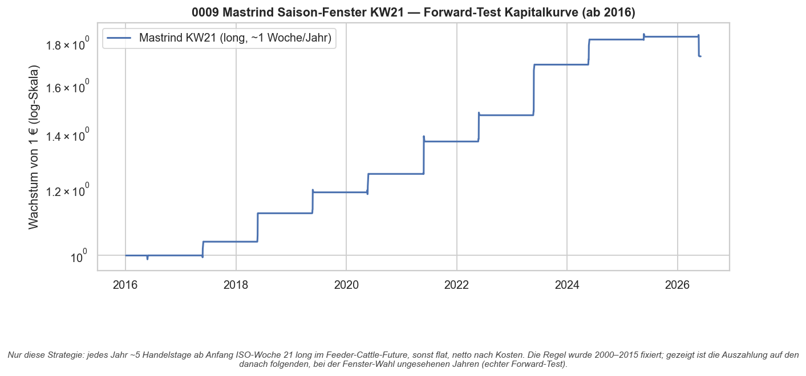
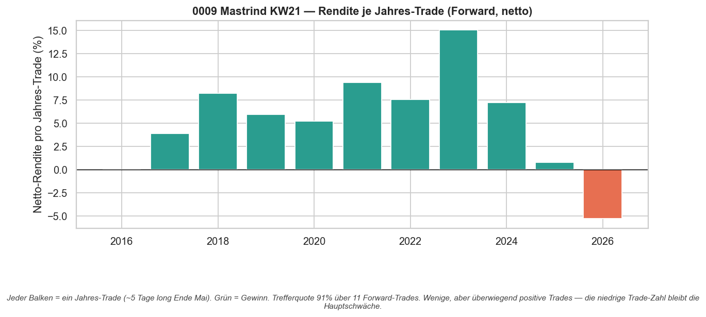
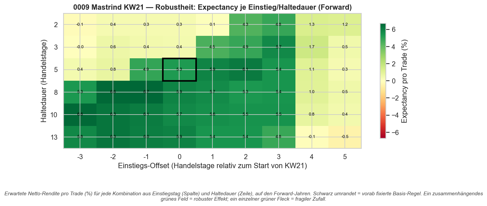

# Strategie 0009 — Mastrind (Feeder Cattle) Saison-Fenster KW21: Forward-Test

- **Kategorie:** seasonal
- **Status:** Kandidat (forward-bestätigt, noch nicht live-fertig) — zweiter nicht
  abgelehnter Lead nach Benzin (0006); eine Schwäche bleibt (Bootstrap-KI berührt Null)
- **Datum:** 2026-06-03
- **Universum:** Mastrind / Feeder-Cattle-Futures (`GF=F`)
- **Stichprobe:** Discovery 2000–2015 (wählte das Fenster) / Forward ab 2016
  (bei der Wahl ungesehen) / Recent-Holdout 2022–2026 (reinste Scheibe)

## 1. Hypothese

0008 scannte 156 Kurzfenster über 20 frische Futures in-sample und fand **ein**
Fenster, das auch out-of-sample hielt: Feeder Cattle long in ISO-Woche 21
(~Ende Mai). Weil es der beste von vielen Treffern über 20 Assets war, könnte es
der zufällige 1-aus-20-Fehlalarm sein. Ehrlicher nächster Schritt — wie bei
Benzin (0005 → 0006): die auf alten Daten fixierte Regel auf Daten testen, die
bei der Wahl **keine** Rolle spielten.

## 2. Makro-Begründung

**Feeder Cattle** = junge Rinder, die vor dem Feedlot-Finishing auf die Weide
gestellt werden. Im **späten Frühjahr** steigt der Nachfragedruck: Beginn der
Weidesaison (Platzierung auf Gras) plus Grill-/Rindfleisch-Nachfrage in die
Memorial-Day-Saison (Ende Mai ≈ KW 21). Ein realer Angebots-/Nachfrage-Zyklus,
keine reine Datenfundstelle.

## 3. Regeln

- **Vorab fixiert (aus 0008):** long Feeder-Cattle-Future ab dem ersten
  Handelstag der ISO-Woche 21, Haltedauer 5 Handelstage, sonst flat. Ein Trade
  pro Jahr.
- **Look-Ahead-Schutz:** Entscheidungszeit-Signal; die Engine verzögert die
  Position um einen Bar (T+1-Ausführung).
- **Kein Such-Burden im Test:** Es wird **eine** vorab festgelegte Regel bewertet
  → Deflated Sharpe mit n_trials = 1 (≈ Probabilistic Sharpe).

## 4. Kosten- & Ausführungsannahmen

`IBKR_FUTURES`: per Kontrakt, ~5 bps Round-Trip (2 bps Slippage + 0,5 bps Gebühr
pro Seite). Engine verzögert das Signal (`.shift(1)`).

## 5. Ergebnisse (netto nach Kosten)

| Kennzahl            | Discovery 2000–2015 | **Forward ab 2016** | Recent 2022–2026 |
| ------------------- | ------------------: | ------------------: | ---------------: |
| CAGR                |               3,27% |          **5,46%**  |            5,51% |
| Sharpe              |               0,32  |          **0,52**   |            0,48  |
| Sortino             |               2,23  |              1,98   |            1,42  |
| Calmar              |               1,84  |              0,91   |            0,92  |
| Max Drawdown        |              -1,78% |             -6,02%  |           -6,02% |
| Trefferquote        |               100%  |          **91%**    |            80%   |
| Profit-Faktor       |               inf   |             11,95   |            5,78  |
| Payoff-Ratio        |               inf   |              1,20   |            1,44  |
| Expectancy/Trade    |               3,22% |              5,27%  |            5,06% |
| Ø Haltedauer        |               5,0 d |              5,0 d  |            5,0 d |
| Trades              |               15    |          **11**     |            5     |

Bemerkenswert: Der **Forward ist stärker als die Discovery** (Sharpe 0,52 vs 0,32,
Expectancy 5,27% vs 3,22%) — das Gegenteil von Overfit, bei dem das Out-of-Sample
einbricht. Auch die reinste Scheibe (2022–2026) bleibt klar positiv.

## 6. Signifikanz (Forward, eine vorab fixierte Regel, n_trials = 1)

| Test                          |             Wert |
| ----------------------------- | ---------------: |
| Permutationstest p-Wert       |            0,000 |
| Bootstrap Sharpe 95%-KI       | **[-0,01; 0,90]**|
| Deflated/Probabilistic Sharpe |            1,000 |
| Trefferquote                  |    91% (10/11 J.)|

**Die eine Schwäche:** Das Bootstrap-KI für den Sharpe **berührt am unteren Rand
die Null** (-0,01). Benzin (0006) war hier sauberer ([0,44; 1,23], schloss Null
klar aus). Der Permutationstest (p ≈ 0,000) und die Trefferquote (10/11) sprechen
dennoch deutlich gegen reinen Zufall.

## 7. Robustheit

**50 von 54** Kombinationen aus Einstiegs-Offset (-3…+5 Tage) und Haltedauer
(2…13 Tage) haben im Forward eine **positive** Expectancy. Das ist ein breites,
zusammenhängendes Plateau — kein fragiler Einzelpunkt. Damit ist die Robustheit
sogar etwas stärker als bei Benzin (dort 47/54). Hauptschwäche bleibt — wie bei
allen Jahres-Fenstern — die **niedrige Trade-Zahl** (11 Forward-Trades).

## 8. Visualisierungen

## 9. Verdict

**Kandidat — behalten.** Feeder Cattle KW21 übersteht den echten Forward-Test:
Forward-Sharpe 0,52, 10/11 Jahre positiv, Permutations-p ≈ 0,000, breites
Robustheits-Plateau (50/54), reinste Scheibe weiter positiv, plausible
Makro-Ursache. Das ist der **zweite** nicht abgelehnte saisonale Lead im Projekt
neben Benzin.

**Demut:** Das Bootstrap-KI berührt die Null, und 11 Trades sind wenig. Es ist
ein belastbarer Kandidat, kein bewiesener Live-Edge. Sinnvolle Verwendung: als
zweites Bein im kombinierten Aktien-Overlay (0010), wo das ganzjährige Index-
Kapital die niedrige Einzel-Power abfedert.

### Artefakte
`results/metrics.json`, `results/equity.csv`, `results/trades.csv`,
`results/card.json`, `results/plots/{forward_equity,per_year_trades,robustness_heatmap}.png`
