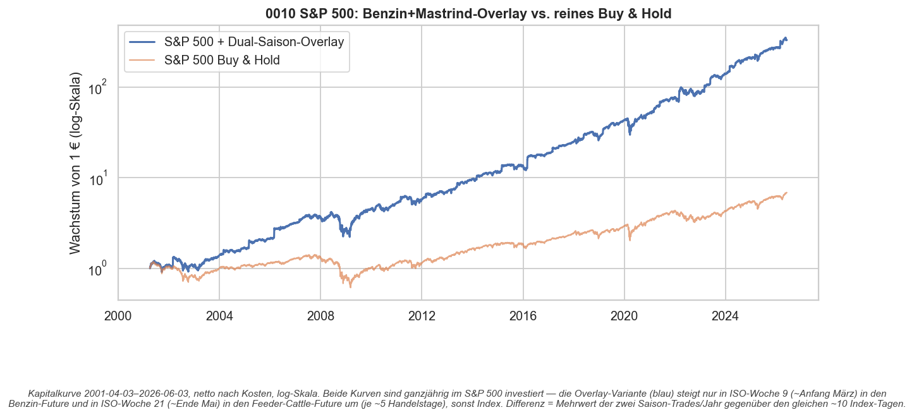
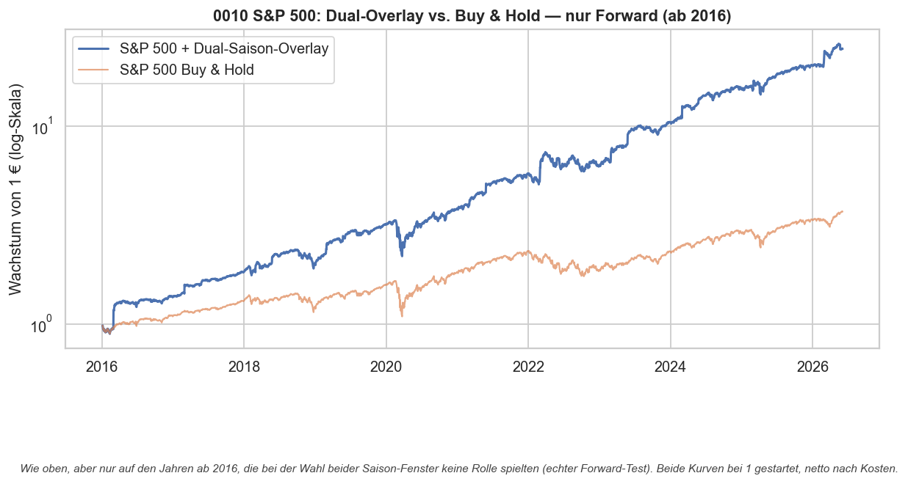
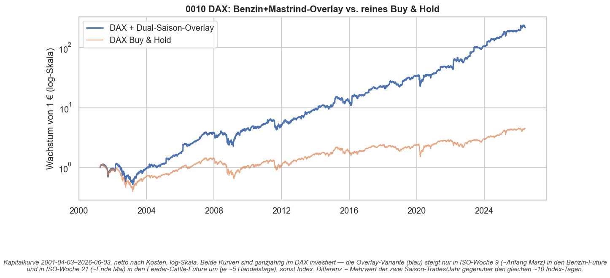
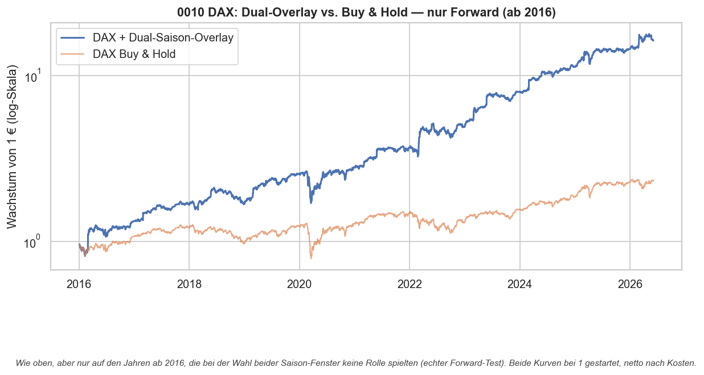

# Strategie 0010 — Duales Saison-Overlay (Benzin KW9 + Mastrind KW21) auf Aktien

- **Kategorie:** seasonal (Overlay)
- **Status:** Kandidat — kapitaleffiziente Bündelung von 0006 (Benzin) und 0009
  (Mastrind) auf einem Aktien-Kern; **kein neuer eigenständiger Edge**
- **Datum:** 2026-06-03
- **Universum:** Aktien-Kern S&P 500 (`^GSPC`) bzw. DAX (`^GDAXI`); Saison-Beine
  Benzin (`RB=F`) und Mastrind/Feeder Cattle (`GF=F`)
- **Stichprobe:** Voll 2001–2026 (durch Futures-Historie begrenzt) / Forward ab 2016

## 1. Hypothese

Verallgemeinerung von 0007. Dort lag das Benzin-KW9-Fenster (0006) als Overlay auf
einem Aktien-Buy-&-Hold-Kern. 0008/0009 lieferten ein **zweites** makro-begründetes
Saison-Bein: Mastrind (`GF=F`), KW21 (~Ende Mai). Die zwei Fenster **überlappen
nicht** (KW9 vs KW21), also lassen sie sich auf denselben Aktien-Kern stapeln:

- ganzjährig im Index (S&P 500 oder DAX) investiert;
- in **ISO-Woche 9** (~Anfang März) ~5 Tage Umstieg in den **Benzin**-Future;
- in **ISO-Woche 21** (~Ende Mai) ~5 Tage Umstieg in den **Feeder-Cattle**-Future;
- danach jeweils zurück in den Index.

## 2. Makro-Begründung

Beide Beine haben einen realen Angebots-/Nachfrage-Treiber: Benzin —
RBOB-Sommerblend-Umstellung + Raffinerie-Wartung im Frühjahr (0006); Mastrind —
Weidesaison-Platzierung + Grillsaison-Nachfrage Ende Mai (0009). Der Aktien-Kern
liefert die Marktprämie für die übrigen ~355 Tage.

## 3. Regeln

- Aktien-Kern: ganzjährig long Index.
- An Tagen mit aktivem Saison-Signal: statt Index der jeweilige Future (T+1-
  verzögerte Position). Die Fenster sind disjunkt → kein Konflikt.
- Look-Ahead-Schutz: Entscheidungszeit-Signal, um einen Bar verzögert.

## 4. Kosten- & Ausführungsannahmen

Pro Umstieg (Entry und Exit) werden eine Futures-Seite (`IBKR_FUTURES`) und eine
liquide-ETF-Seite (`IBKR_LIQUID_ETF`) als Slippage+Gebühr in bps berechnet — bis
zu **vier** Umstiege pro Jahr (zwei je Bein).

## 5. Ergebnisse (netto nach Kosten)

### S&P 500

| Kennzahl     | Voll: Overlay | Voll: B&H | **Forward: Overlay** | Forward: B&H |
| ------------ | ------------: | --------: | -------------------: | -----------: |
| CAGR         |        26,22% |     8,02% |          **36,17%**  |       13,46% |
| Sharpe       |         1,04  |     0,40  |          **1,36**    |        0,68  |
| Sortino      |         1,55  |     0,50  |              2,06    |        0,83  |
| Volatilität  |        22,99% |    19,10% |             23,21%   |       17,99% |
| Max Drawdown |       -47,06% |   -56,78% |            -34,07%   |      -33,92% |

### DAX

| Kennzahl     | Voll: Overlay | Voll: B&H | **Forward: Overlay** | Forward: B&H |
| ------------ | ------------: | --------: | -------------------: | -----------: |
| CAGR         |        24,50% |     6,29% |          **31,48%**  |        8,55% |
| Sharpe       |         0,90  |     0,30  |          **1,18**    |        0,43  |
| Sortino      |         1,35  |     0,39  |              1,88    |        0,54  |
| Volatilität  |        25,95% |    22,65% |             23,88%   |       18,85% |
| Max Drawdown |       -56,00% |   -64,91% |            -35,67%   |      -38,78% |

**Bild:** Das Overlay verdoppelt bis verdreifacht Sharpe und CAGR gegenüber reinem
Buy & Hold, bei nur ~3–4 % höherer Volatilität und **kleinerem** Drawdown (die
Saison-Tage weichen gelegentlich schlechten Index-Tagen aus). Auf der ehrlichen
Forward-Periode (ab 2016): S&P-Overlay 36,2 % / Sharpe 1,36 vs B&H 13,5 % / 0,68;
DAX-Overlay 31,5 % / 1,18 vs 8,6 % / 0,43.

## 6. Einordnung & Signifikanz

Dies ist **kein neuer Edge**, sondern die Bündelung zweier bereits einzeln
forward-getesteter Saison-Beine (0006, 0009) plus Marktprämie. Die belastbare
Signifikanz liegt **in den Einzelstrategien**:

- Benzin (0006): Forward-Sharpe 0,86, Perm-p ≈ 0,000, Bootstrap-KI [0,44; 1,23].
- Mastrind (0009): Forward-Sharpe 0,52, Perm-p ≈ 0,000, Bootstrap-KI [-0,01; 0,90]
  (berührt knapp die Null — die Hauptschwäche, die das Overlay miterbt).

Die im Lauf gezeigten Voll-Sample-Trefferquoten (Benzin/Mastrind je 96 % über
25/26 Trades) enthalten auch die **In-Sample-Discovery-Jahre** und sind daher
optimistisch — der ehrliche Maßstab ist die Forward-Spalte oben.

## 7. Robustheit & Vorbehalte

- **Beide Beine forward-positiv** und auf zwei Indizes (S&P **und** DAX)
  konsistent — der Mehrwert ist nicht an einen Markt geknüpft.
- **Notional-Vereinfachung:** Das Modell schichtet 100 % zwischen Index und Future
  um („entweder/oder"). Real wird ein Future auf Margin gehalten — eine echte
  Umsetzung könnte den Index **behalten** und zusätzlich Margin für das Saison-Bein
  stellen. Diese Version ist damit die **konservative** Variante.
- **Niedrige Trade-Zahl bleibt:** 2 Saison-Trades/Jahr/Bein. Der Aktien-Kern
  liefert die Power für die übrigen Tage und federt die Einzel-Fragilität ab.

## 8. Visualisierungen

## 9. Verdict

**Kandidat — behalten als kapitaleffiziente Hebelung von 0006 + 0009.** Das
Stapeln von Benzin- und Mastrind-Fenster auf einen Aktien-Kern schlägt reines
Buy & Hold auf S&P 500 und DAX deutlich (Forward-Sharpe 1,36 bzw. 1,18 vs
0,68 bzw. 0,43) bei geringerem Drawdown. Es erzeugt **keinen** neuen statistischen
Edge — seine Güte steht und fällt mit den zwei Einzelstrategien, insbesondere mit
dem noch knappen Mastrind-Signal. Nächster sinnvoller Schritt: weitere
forward-getestete Saison-Beine (sofern sie auftauchen) nach demselben Muster
ergänzen.

### Artefakte
`results/metrics.json`, `results/equity.csv`, `results/card.json`,
`results/plots/overlay_{gspc,gdaxi}{,_forward}.png`
