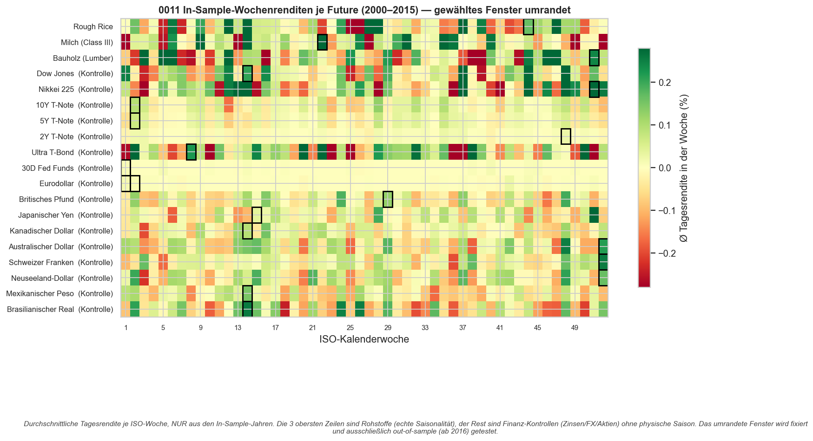
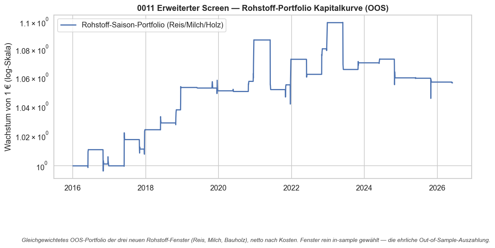

# Strategie 0011 — Erweiterter saisonaler Futures-Screen (3. Durchlauf)

- **Kategorie:** seasonal
- **Status:** abgelehnt (rejected) — dritte Bestätigung der 0005/0008-Lehre; ein
  marginaler Rohstoff-Treffer (Bauholz), der **nicht** eskaliert wird
- **Datum:** 2026-06-03
- **Universum:** 19 distinkte, IBKR-handelbare Futures mit nutzbarer
  yfinance-Historie, davon **3 Rohstoffe** (Rough Rice, Milch, Bauholz) und
  **16 Finanz-Kontrollen** (Zinsen, FX, Aktienindizes)
- **Stichprobe:** In-Sample 2000–2015 (Fenster-Wahl) / Out-of-Sample ab 2016 (Test)

## 1. Hypothese & Auftrag

Auftrag: weitere ~50 Futures finden, auf IBKR-Handelbarkeit prüfen, Exotisches
weglassen, denselben IS/OOS-Screen wie 0008 fahren. Ziel: weitere saisonale
Edges neben Benzin (0006) und Mastrind (0009).

## 2. Der Daten-Trichter (das eigentliche Kernergebnis)

Die binden­de Grenze ist **nicht** IBKR — fast alle Kontrakte sind dort handelbar
— sondern die **Datenquelle yfinance**. Von 50 handverlesenen Kandidaten
(`probe.py`):

| Stufe                                                   | Anzahl |
| ------------------------------------------------------- | -----: |
| Kandidaten geprüft                                      |     50 |
| mit nutzbarer Historie (IS ≥ 5 J., OOS ≥ 1 J., Preis>0) |     24 |
| davon **distinkte neue** Märkte (keine Duplikate)       | **19** |
| davon **Rohstoffe mit physischer Saisonalität**         |  **3** |

Weggefallen und warum:
- **Kein yfinance-Symbol:** Canola (`RS=F`), Minneapolis-Weizen (`MW=F`),
  Dollar-Index (`DX=F`).
- **Zu kurze Historie** (kein In-Sample vor 2016): Russell 2000 (`RTY`, ab 2017),
  Aluminium (`ALI`, ab 2014), Ultra-10Y (`TN`, ab 2016), **alle Krypto-Futures**
  (BTC ab 2017), **alle Micro-Kontrakte** (MES/MNQ/… ab 2019).
- **Reine Duplikate** bereits getesteter Underlyings: `QC`=Kupfer, `QG`=Erdgas,
  `QO/QI/MGC`=Gold/Silber — identische Saisonalität wie in 0005/0008, daher
  ausgeschlossen (Testen wäre verbranntes Mehrfachtest-Budget ohne Erkenntnis).

**Befund:** 50 distinkte, langhistorisierte Futures existieren bei yfinance
schlicht nicht. Das praktisch testbare Universum „neuer Rohstoff mit physischer
Saison + Historie" ist mit Reis/Milch/Holz **erschöpft**. Der Rest sind
Finanz-Futures = Kontrollgruppe.

## 3. Regeln & Bias-Schutz

Identisch zu 0005/0008: je Asset 156 Fenster (52 Startwochen × 1/2/3 Wochen)
in-sample scannen, bestes (exposure-neutrale Sharpe) fixieren, **nur** OOS
bewerten. Engine verzögert das Signal (T+1). Deflated Sharpe je Asset mit
n_trials = 156. **Look-Ahead-Schutz** über die `.shift(1)`-Engine.

## 4. Ergebnisse (OOS, netto)

| Future                | Typ        | Fenster | IS-Sharpe | OOS-Sharpe |  Perm-p | Trades |
| --------------------- | ---------- | ------: | --------: | ---------: | ------: | -----: |
| Bauholz (Lumber)      | Rohstoff   |   KW 51 |      5.46 |   **0.39** |   0.033 |    **7** |
| Rough Rice            | Rohstoff   |   KW 44 |      5.27 |      -0.63 |   0.607 |     10 |
| Milch (Class III)     | Rohstoff   |   KW 22 |      5.30 |      -0.70 |   0.416 |     11 |
| Dow Jones             | Kontrolle  |   KW 14 |      3.75 |      -0.67 |   0.376 |     11 |
| … 15 weitere Kontrollen (FX/Zinsen/Aktien) | Kontrolle | – | 1.8–10.7 | **-0.8 bis -26.8** | 0.11–0.98 | 8–11 |

**Das Bild — zum dritten Mal:** Die IS-Sharpe-Spalte (1,8–10,7) ist reiner
Overfit; **18 von 19 Fenstern kollabieren OOS**, viele extrem negativ (Zinsen/
Fed-Funds bis OOS-Sharpe -27, weil ein in-sample „grünes" Wochenfenster auf einem
trendarmen Carry-Instrument out-of-sample exakt das Gegenteil liefert).

### Rohstoff-Portfolio (Reis/Milch/Holz, OOS)

| Kennzahl    |              Wert |
| ----------- | ----------------: |
| CAGR        |             0,5%  |
| Sharpe      |            -0,69  |
| Bootstrap-KI| [-1,28; -0,08]    |

Das KI schließt die Null auf der **negativen** Seite — kein Portfolio-Edge.

## 5. Der Kontroll-Check (methodisch das Wertvollste)

**0 von 16 Finanz-Kontrollen** erreichen perm-p < 0,10 — bei reinem Zufall wären
~1,6 zu erwarten. Die Methode **erfindet keine** Saison-Signale dort, wo es
physisch keine geben darf (Zinsen, FX, Aktienindizes). Das ist die saubere
Bestätigung, dass Benzin (0006) und Mastrind (0009) **nicht** bloß Produkte einer
Methode sind, die überall Fehlalarme streut — sonst hätten hier mehrere Kontrollen
„angeschlagen".

## 6. Der eine marginale Treffer: Bauholz, und warum er NICHT eskaliert wird

Bauholz (`LBS=F`), KW 51 (~Ende Dezember): OOS-Sharpe 0,39, perm-p 0,033 — klärt
die Bonferroni-Hürde (0,10/3) **exakt an der Kante**. Trotzdem **kein** Kandidat
für einen Forward-Test wie Benzin/Mastrind, aus drei Gründen:

1. **Nur 7 Trades.** `LBS=F` wurde **Mitte 2023 eingestellt** (ersetzt durch den
   kleineren `LBR`-Kontrakt). Das getestete Fenster ist also nicht einmal sauber
   weiterhandelbar.
2. **Schwache Makro-Story.** KW 51 = Jahresende. Das riecht eher nach einem
   generischen Turn-of-Year-Effekt (vgl. 0001) als nach einer holzspezifischen
   Angebots-/Nachfrage-Ursache (die Bauholz-Saison läuft im **Frühjahr** mit der
   Bausaison, nicht Ende Dezember).
3. **Mehrfachtest-Familie.** Über 0005+0008+0011 sind nun **47 distinkte
   Underlyings** gescannt (~7.300 Fenster). Ein einzelner p = 0,033-Treffer in
   dieser Familie ist genau das, was Rauschen produziert. Benzin/Mastrind hatten
   perm-p ≈ 0,000 **und** bestanden einen unabhängigen Forward-Test — Bauholz hat
   beides nicht.

## 7. Visualisierungen

## 8. Verdict

**Abgelehnt.** Dritte, breiteste Bestätigung, dass „bestes In-Sample-Wochenfenster
handeln" nicht generalisiert: 18/19 kollabieren OOS, das Rohstoff-Portfolio ist
negativ. Der einzige Treffer (Bauholz) ist ein marginaler, makro-schwacher Blip
auf einem **eingestellten** Kontrakt — kein Forward-Kandidat.

**Strategische Konsequenz:** Das per yfinance testbare Saison-Rohstoff-Universum
ist erschöpft. „Mehr Ticker" ist **nicht** mehr der Hebel — die Datenquelle
limitiert. Um es „zur Spitze zu treiben", bleiben drei echte Optionen:
1. **Die zwei bestehenden Kandidaten vertiefen** (Benzin 0006, Mastrind 0009):
   Positionsgrößen, Kontrakt-Roll-Mechanik, Live-Forward-Registrierung.
2. **Bessere Datenquelle** für echte Futures-Breite (z. B. Stevens/Barchart/
   Norgate Continuous Contracts) — dann ließen sich Hunderte IBKR-Futures testen.
3. **Methoden-Pivot** weg vom Kalender hin zu zustandsbasierten Edges
   (Cross-Asset-Momentum, Mean-Reversion mit Volumen) — wo die Trade-Zahl und
   damit die statistische Power deutlich höher liegt.

### Artefakte
`probe.py`, `results/metrics.json`, `results/screen_panel.csv`,
`results/equity.csv`, `results/card.json`,
`results/plots/{weekly_returns_is,portfolio_equity}.png`
