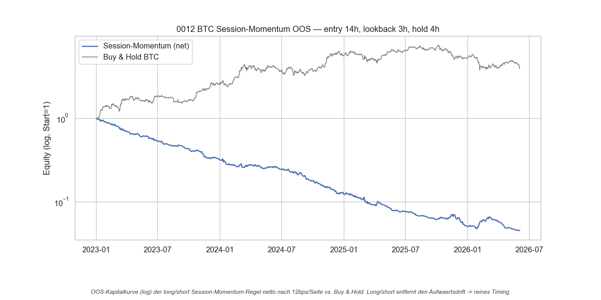
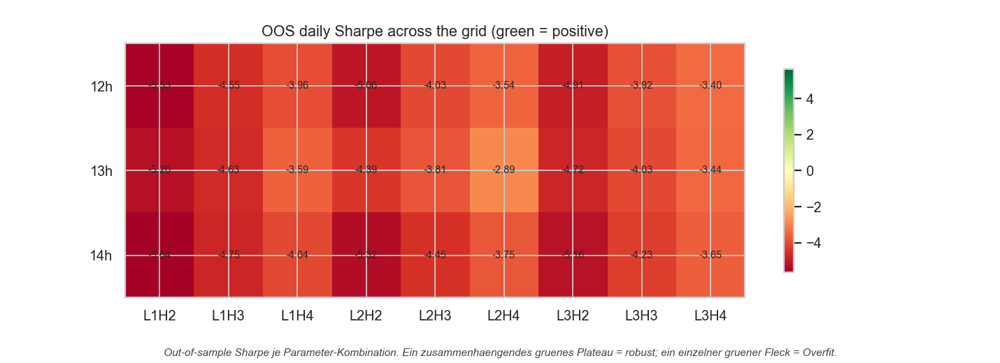

# Strategie 0012 — BTC Intraday Session-Momentum (US-Fenster)

- **Kategorie:** momentum / intraday
- **Status:** abgelehnt (rejected) — **kein Brutto-Edge**; realistische Kosten
  verwandeln eine Null-Linie in einen stetigen Verlust
- **Datum:** 2026-06-04
- **Markt:** BTC/USDT 1h (Binance), 2017-08-17 .. 2026-06-03 (76.977 Kerzen)
- **Stichprobe:** In-Sample 2017-08..2022-12 (Fenster-Wahl) / Out-of-Sample
  ab 2023-01 (Test)

## 1. Hypothese & Begründung

Aus `analysis/btc_hourly_volatility.py`: Bitcoins Volatilität ballt sich klar im
**US-Fenster 13–16 UTC** (Peak 14:00 UTC, ~50 % mehr Vola als die ruhigste
Stunde 05 UTC). Ökonomische Ursache: US-Institutionen + US-Makro-Releases
(meist 12:30–14:00 UTC) treiben den Flow, auch im 24/7-Kryptomarkt.

**Hypothese:** Ein gerichteter Impuls, der sich *in* dieses Hochvola-Fenster
hinein bildet, **setzt sich fort** (Intraday-Momentum durch institutionellen
Trendflow). Die toten Stunden (03–06 UTC) werden gemieden.

**Regel (long/short):** Am Schluss von Stunde `e` das Vorzeichen der Rendite der
letzten `L` Stunden nehmen, diese Richtung `H` Stunden halten (das aktive
Fenster), sonst flat. Long/short, um den Krypto-Aufwärtsdrift herauszurechnen
und **reines Timing** zu messen — kein versteckter Buy-&-Hold-Bonus.

## 2. Methodik & Bias-Schutz

- **Stunden-Engine, Look-Ahead-sicher:** Signal wird zur Entscheidungszeit
  (Schluss Stunde `e`) gesetzt, die Engine `.shift(1)`-verzögert die Position
  (Halten ab `e+1`).
- **Realistische Krypto-Kosten:** Binance-Spot-Taker 0,10 % (10 bps) + 2 bps
  Slippage = **12 bps/Seite, 24 bps Round-Trip**. Bei ~1 Round-Trip/Tag sind das
  ~**60 % Kostenabrieb pro Jahr** — der härteste, aber ehrliche Test für jede
  täglich umschlagende Intraday-Idee.
- **IS/OOS-Disziplin:** kleines, vorab deklariertes 3×3×3-Gitter (Entry
  {12,13,14}h × Lookback {1,2,3}h × Hold {2,3,4}h = **27 Trials**). IS wählt das
  beste, OOS bewertet nur die fixierte Regel.
- **Kennzahlen auf Tagesbasis** (sauberer statistischer Takt, `periods_per_year=365`).
- Permutation, Bootstrap-KI, **Deflated Sharpe mit n_trials = 27**.

## 3. Ergebnisse (OOS 2023-01 .. 2026-06, netto)

| Kennzahl                 |                  Wert |
| ------------------------ | --------------------: |
| Gewähltes Fenster (IS)   | entry 14h, L 3h, H 4h |
| **IS Daily Sharpe (best of 27)** |        **-2,50** |
| OOS CAGR (netto)         |               -59,3 % |
| OOS Sharpe (netto)       |             **-3,65** |
| **OOS Sharpe (brutto)**  |             **-0,06** |
| OOS MaxDD                |               -95,5 % |
| Trades                   |                 1.250 |
| Win-Rate                 |                34,5 % |
| Profit Factor            |                  0,58 |
| Permutation p            |              1,0000 |
| Bootstrap Sharpe 95%-KI  |       [-4,00; -2,22] |
| Deflated Sharpe (PSR)    |                 0,000 |
| OOS-Gitter positiv       |          **0 / 27**  |
| Buy & Hold (Referenz)    |  CAGR 49,4 %, Sharpe 1,04 |

## 4. Interpretation — der eigentliche Befund

**Das Schlüsselzahlenpaar ist Brutto-Sharpe -0,06 vs. Netto-Sharpe -3,65.**

1. **Brutto ≈ 0 → es gibt gar keinen Edge.** Schon *vor* Kosten ist die Strategie
   ein Münzwurf (Brutto-Sharpe -0,06, praktisch null). Das Momentum-Signal trägt
   im US-Fenster **keine** verwertbare Richtungsinformation. Das ist die
   sauberste Form der Ablehnung: nicht „guter Edge, von Kosten gefressen",
   sondern „kein Signal vorhanden".
2. **Kosten verwandeln Null in stetigen Verlust.** Die OOS-Kurve fällt auf
   Log-Skala fast als **Gerade mit konstanter Steigung** — die Signatur reinen,
   gleichmäßigen Kostenabriebs (24 bps × ~365 Trades/Jahr) ohne jeden
   kompensierenden Brutto-Ertrag.
3. **Schon in-sample negativ.** Selbst der *beste* von 27 Kombinationen hatte IS
   Sharpe **-2,50** — es gab nichts zu überanpassen. Anders als bei den
   Saison-Strategien (wo IS-Sharpes von 4–8 Overfit signalisierten) liefert das
   Gitter hier nirgends einen Schein-Edge.
4. **Alle drei Signifikanztests bestätigen einstimmig:** Permutation p = 1,00
   (Zufalls-Timing ist praktisch *immer* besser), Bootstrap-KI komplett negativ
   [-4,00; -2,22], DSR 0,000, **0/27** Gitter-Kombinationen positiv.

**Die Lehre:** Die Vola-Analyse hat gezeigt, *wann* sich Bitcoin bewegt — aber
**nicht, in welche Richtung**. Hohe Volatilität ist richtungslos. Zu wissen,
dass 14 UTC die bewegteste Stunde ist, ist kein Edge; man braucht zusätzlich
einen Grund, *welche* Seite zu nehmen. Das einfache „Vorstunden-Impuls setzt
sich fort" liefert diesen Grund nicht.

## 5. Was das über Mean-Reversion sagt

Da `gross_return = position · asset_ret`, ist die exakte Gegenstrategie
(Mean-Reversion / Fade) brutto = **+0,06** Sharpe — ebenfalls praktisch null.
Auch das Faden des Impulses im selben Fenster ist **kein** Edge. Beide
Richtungen sind brutto ein Münzwurf; eine separate, vorab registrierte
Mean-Reversion-Hypothese müsste also einen *anderen* Mechanismus nutzen (z. B.
Überdehnung relativ zu einem Band, nicht bloß das Vorzeichen der Vorstunde).

## 6. Visualisierungen

## 7. Verdict

**Abgelehnt.** Das Intraday-Session-Momentum hat **keinen Brutto-Edge**
(Sharpe -0,06); realistische Krypto-Kosten machen daraus einen stetigen,
brutalen Verlust (Netto -3,65, -95 % MaxDD). 0/27 Gitter-Kombinationen positiv,
alle Signifikanztests einstimmig negativ.

**Strategische Konsequenz / nächste Schritte:**
1. **Volatilität ≠ Richtung.** Der nächste Intraday-Versuch braucht ein Signal
   mit echtem *Richtungs*-Mechanismus, nicht nur Timing der Aktivität.
2. **Kosten sind der Gegner.** Bei ~24 bps Round-Trip muss eine täglich
   umschlagende Regel >24 bps Brutto-Edge je Trade liefern. Realistischer sind
   Ansätze mit **niedrigerem Umschlag** (seltener handeln) oder **Maker-Limit**
   statt Taker.
3. **Höhere Power ist da.** 1.250 OOS-Trades (vs. ~11 bei den Saison-Kandidaten)
   bestätigen: der Intraday-Krypto-Pfad hat die statistische Power, die den
   Saison-Strategien fehlt — wir müssen nur eine Hypothese mit echtem Mechanismus
   finden (z. B. Überdehnungs-Mean-Reversion, Volumen-/Orderflow-getrieben).

### Artefakte
`run.py`, `results/metrics.json`, `results/equity.csv`, `results/trades.csv`,
`results/oos_grid_sharpe.csv`, `results/card.json`,
`results/plots/{oos_equity,oos_robustness}.png`. Datenlader:
`src/quantlab/crypto_data.py`. Vola-Analyse: `analysis/btc_hourly_volatility.py`.
