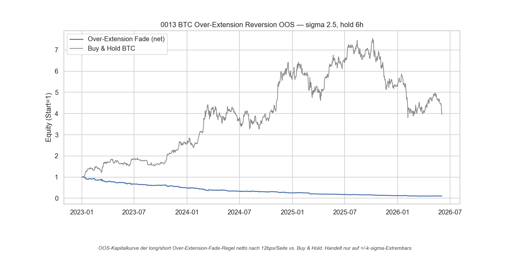
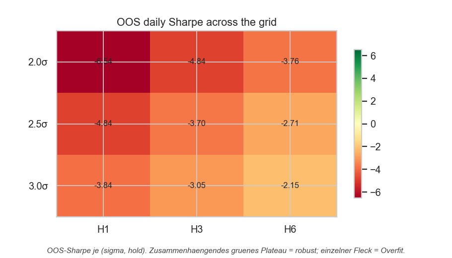

# Strategie 0013 — BTC Intraday Over-Extension Mean-Reversion

- **Kategorie:** mean-reversion / intraday
- **Status:** abgelehnt (rejected) — Fade ist **brutto negativ**; das Vorzeichen
  zeigt: Extrem-Stunden **setzen sich fort** (Momentum), kehren nicht um. Beide
  Richtungen scheitern netto an den Kosten.
- **Datum:** 2026-06-04
- **Markt:** BTC/USDT 1h (Binance), 2017-08..2026-06
- **Stichprobe:** In-Sample 2017-08..2022-12 / Out-of-Sample ab 2023-01

## 1. Hypothese & Begründung

Antwort auf die Lehre aus 0012 („Vola ≠ Richtung"): eine Regel mit echtem
**Richtungsmechanismus** und **niedrigem Umschlag**. Hypothese: Nach einem
Extrem-Ausschlag in einer Stunde (Rendite jenseits ±k·σ, σ = rollende 7-Tage-Std
der Stunden-Renditen) **überreagiert** der Markt und kehrt teilweise zurück →
**Fade** (Spike hoch → short, Spike runter → long), `H` Stunden halten, sonst
flat. Ökonomik: Liquiditäts-/Überreaktions-Rückkehr nach einem Stress-Move.
Vorteil: handelt nur auf Extrembars → weit weniger Round-Trips als 0012.

## 2. Methodik & Bias-Schutz

- σ-Fenster **fix bei 168h (7 Tage)**, Normalizer um 1 Bar verzögert (die
  aktuelle Rendite verseucht ihr eigenes σ nicht).
- Vorab deklariertes **3×3-Gitter**: σ ∈ {2,0; 2,5; 3,0} × Hold ∈ {1,3,6}h = **9
  Trials**. IS wählt, OOS bewertet nur die fixierte Regel.
- Stunden-Engine Look-Ahead-sicher (`.shift(1)`); Kennzahlen auf Tagesbasis
  (`periods_per_year=365`).
- Krypto-Kosten Binance-Taker 10 bps + 2 bps Slippage = **12 bps/Seite**.
- Permutation, Bootstrap-KI, Deflated Sharpe mit **n_trials = 9**.

## 3. Ergebnisse (OOS 2023-01 .. 2026-06, netto)

| Kennzahl                |              Wert |
| ----------------------- | ----------------: |
| Gewähltes Fenster (IS)  |  σ 2,5, Hold 6h |
| IS Daily Sharpe (best/9)|            -0,924 |
| OOS CAGR (netto)        |           -48,6 % |
| OOS Sharpe (netto)      |         **-2,71** |
| **OOS Sharpe (brutto)** |         **-0,37** |
| OOS MaxDD               |           -90,0 % |
| Trades                  |               803 |
| Win-Rate / PF           |   44,3 % / 0,62 |
| Permutation p           |            0,9930 |
| Bootstrap Sharpe 95%-KI |    [-3,14; -1,41] |
| Deflated Sharpe (PSR)   |             0,000 |
| OOS-Gitter positiv      |         **0 / 9** |
| Buy & Hold (Referenz)   | CAGR 49,4 %, Sharpe 1,04 |

OOS-Gitter (Netto-Sharpe): durchweg negativ, monoton besser mit höherem σ und
längerem Hold (von -6,54 bei 2,0σ/1h bis -2,15 bei 3,0σ/6h) — d. h. **je seltener
gehandelt, desto weniger Verlust**. Das ist die Kosten-Signatur, kein Edge.

## 4. Interpretation — die eigentliche Erkenntnis

**Brutto-Sharpe ist -0,37, nicht ~0.** Das ist qualitativ anders als bei 0012
(dort brutto ≈ 0). Ein *negativer* Fade-Brutto bedeutet per Konstruktion
(`gross = position · ret`): die **Gegenrichtung — Extrembewegungen mitreiten —
ist brutto positiv (~+0,37)**.

> **Mikro-Befund: Extreme Stunden-Moves bei BTC zeigen kurzfristige
> *Fortsetzung* (Momentum/Ignition), keine Umkehr.** Die naive
> Mean-Reversion-Intuition ist hier falsch — ein σ-Ausschlag signalisiert
> informierten Flow, der sich über die nächsten Stunden eher fortsetzt.

**Aber auch die Fortsetzungs-Richtung ist nicht handelbar.** Der Brutto-Edge ist
mit ~0,37 Sharpe **viel zu schwach** für den Umschlag: ~800 Trades × 24 bps
Round-Trip ergeben einen Kostenabrieb von ~2,3 Sharpe-Einheiten. Selbst die
positive Richtung landet damit netto bei ~-2,0 — tief negativ. Die Kurve bleibt
ein stetiger Abrieb.

## 5. Schlussfolgerung — Kosten sind die bindende Grenze

Über 0012 und 0013 zeichnet sich dasselbe Muster ab: Der **Brutto-Edge auf
1h-BTC ist klein (|Sharpe| ≲ 0,4)**, egal ob Momentum oder Reversion, und der
24-bps-Round-Trip frisst ihn bei täglichem/häufigem Umschlag komplett. Das
Gitter zeigt klar: **weniger handeln = weniger Verlust** — der Hebel ist nicht
die Richtung, sondern der **Umschlag/Kosten**.

## 6. Visualisierungen

## 7. Verdict

**Abgelehnt.** Über-Extensions-Fade ist brutto negativ (-0,37) und netto
desaströs (-2,71, -90 % MaxDD), 0/9 Gitter positiv, alle Signifikanztests
einstimmig negativ. Wertvoller Nebenbefund: BTC-Extrem-Stunden **kontinuieren**
kurzfristig — aber zu schwach, um die Kosten zu schlagen.

**Nächste Schritte (Kosten-getrieben, nicht richtungs-getrieben):**
1. **Umschlag drastisch senken.** Bei nur ~0,4 Brutto-Sharpe muss die Trade-Zahl
   um ~10× runter (höhere Schwellen, Tages- statt Stunden-Bars, längere Holds),
   damit überhaupt ein Netto-Rest bleibt.
2. **Maker statt Taker.** Limit-Entries bei 0 bps Fee statt 10 bps würden den
   Round-Trip etwa halbieren — ändert die Rechnung qualitativ.
3. **Stärkeres Brutto-Signal suchen**, nicht nur das Vorzeichen: z. B.
   Volumen-/Orderflow-bestätigte Ausbrüche, Funding-Rate-Extreme, Cross-Asset
   (BTC-ETH-Lead-Lag) — Mechanismen mit potenziell größerem Edge je Trade.
4. **Continuation als vorab registrierten Test** (0014) sauber prüfen — aber nur
   in einer **Niedrig-Umschlag-Variante**, sonst bekannt-tot durch Kosten.

### Artefakte
`run.py`, `results/metrics.json`, `results/{equity,trades,oos_grid_sharpe}.csv`,
`results/card.json`, `results/plots/{oos_equity,oos_robustness}.png`.
