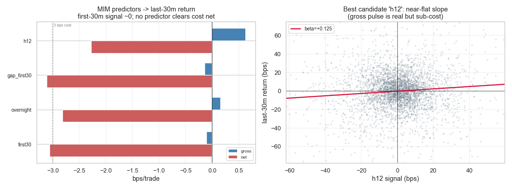

# Strategie 0049 — Market Intraday Momentum (Gao/Han/Li/Zhou 2018)

- **Kategorie:** momentum / intraday / strukturell
- **Status:** rejected
- **Datum:** 2026-06-10
- **Universum:** S&P-500-E-mini-Future (ES.c.0, Databento GLBX.MDP3); Renditen
  identisch zum Micro-E-mini (MES) → Kostenmodell `MES_INTRADAY`.
- **Stichprobe:** In-Sample 2010-06 … 2018-12 (2 098 Sessions) / Out-of-Sample
  2019-01 … 2026-06 (1 821 Sessions); gesamt 3 919 RTH-Sessions.

## 1. Hypothese

Die Rendite der **ersten halben Stunde** der regulären Handelssession
(09:30–10:00 ET), optional inklusive des **Übernacht-Gaps**, sagt das Vorzeichen
der Rendite der **letzten halben Stunde** (15:30–16:00 ET) voraus. Handel: ein
Trade/Tag, nur das Schlussfenster gehalten, flat zum Close — prop-tauglich par
excellence.

## 2. Makro-Begründung

Im Paper *strukturell, nicht behavioral*: Options-Market-Maker hedgen ihr
Gamma in Trendrichtung in den Close; Leveraged-ETFs müssen ihre Hebel-Exposure
gegen Sessionende mechanisch in Trendrichtung rebalancen. Beide erzeugen einen
flow-getriebenen, vorzeichen-erhaltenden Druck auf das Schlussfenster. Plausible
Ursache — deshalb überhaupt getestet, trotz unseres eigenen Gegenbefunds aus
0040/0041 (ES-Intraday-Autokorrelation ≈ 0).

## 3. Regeln

- **Signal (Entscheidungszeit 10:00 bzw. 15:30):** Vorzeichen eines Prädiktors:
  `first30` (Close 10:00 / Open 09:30), `overnight` (Open 09:30 / Vortags-Close
  16:00), `gap_first30` (kombiniert) oder `h12` (Close 15:30 / Open 15:00,
  12. Halbstunde).
- **Position:** `sign(Signal)`, gehalten ausschließlich über das **letzte
  Halbstunden-Fenster** (15:30 Open → 16:00 Close). Sonst flat.
- **Look-Ahead-Schutz:** Jedes Signal ist vor dem Trade vollständig bekannt
  (first30 um >5 h, h12 um exakt den Fenster-Beginn). Die getradete Bar fließt
  nie ins Signal ein. Audit im Docstring von `run.py`.

## 4. Kosten- & Ausführungsannahmen

`MES_INTRADAY`: 1,5 bps/Seite (Kommission + halber Tick + Auktions-Impact,
konservativ gepolstert) → **3,0 bps Round-Trip** pro Trade. Ein Round-Trip/Tag
(Entry 15:30, Exit 16:00).

## 5. Ergebnisse (Out-of-Sample, netto nach Kosten)

Headline: das **kanonische Signal** (`first30 → last30`) ist leer. Bester
Brutto-Kandidat ist `h12` (Momentum-Continuation in den Close):

| Prädiktor → letzte 30 min | beta | corr | Brutto-Sharpe | Brutto bps | **Netto bps** | Win % |
| ------------------------- | ---: | ---: | ------------: | ---------: | ------------: | ----: |
| `first30` (Paper-Kern)    | −0,007 | −0,007 | −0,05 | −0,10 | **−3,06** | 47,8 |
| `overnight` (Gap)         | +0,019 | +0,045 | +0,08 | +0,16 | **−2,81** | 49,0 |
| `gap_first30`             | +0,015 | +0,037 | −0,07 | −0,14 | **−3,11** | 47,8 |
| `h12` (12. Halbstunde)    | +0,125 | +0,087 | +0,34 | +0,63 | **−2,27** | 47,1 |

Magnitude-Conditioning (nur Top-Tercil |Signal|-Tage) — einzige fast-Breakeven-Zelle:

| Zelle | Brutto-Sharpe | Brutto bps | **Netto bps** | Win % |
| ----- | ------------: | ---------: | ------------: | ----: |
| `h12 \|top3\|` | +1,08 | +2,97 | **−0,03** | 51,3 |

Letzte-30-min-Ziel: Std 29,6 bps, Mittel −0,08 bps. **Kein** Prädiktor und
**keine** Konditionierung erreicht netto positiv; die beste Zelle ist exakt
Breakeven (−0,03 bps) bei Win 51,3 %.

## 6. Signifikanz (bester Brutto-Kandidat `h12`, voller Sample)

| Test                          | Wert |
| ----------------------------- | ---: |
| Permutationstest p-Wert (Brutto-Sharpe) | 0,091 |
| Bootstrap Brutto-Sharpe 95 %-KI | [−0,59, +0,41] |
| Deflated Sharpe (N = 8 Zellen) | 0,450 |
| t-Test mittlere **Netto**-Rendite | t = −4,82, p = 0,000 |

Permutation knapp nicht signifikant (p = 0,091); Bootstrap-KI schließt 0 ein;
DSR 0,450 < 0,5 → mit Selektions-Glück über die 8 gescannten Zellen vereinbar;
der einzige hochsignifikante Test ist der t-Test auf die Netto-Rendite — und der
ist **signifikant negativ**.

## 7. Robustheit

- **IS → OOS (`h12`, brutto):** IS Sharpe +0,14 (+0,22 bps) → OOS +0,51
  (+1,10 bps). Der Brutto-Puls ist OOS sogar stärker — aber so klein, dass er
  netto in beiden Hälften negativ bleibt (IS −1,68 / OOS −0,86).
- **`first30`-Kern:** beta −0,007, corr −0,007 → die im Paper zentrale
  Autokorrelation existiert auf ES 2010-2026 schlicht nicht. Direkte Bestätigung
  von 0040 (corr Morgen→Nachmittag +0,02) und 0041 (ES-Autokorr ≈ 0).
- **Magnitude-Conditioning** rettet nichts: `first30 |top3|` wird sogar
  *negativer* (−0,30 Sharpe); nur `h12 |top3|` erreicht Breakeven.

## 8. Verdict

**Abgelehnt.** Zwei Gründe: (1) Das kanonische Gao-et-al.-Signal (erste 30 min →
letzte 30 min) ist auf ES leer (beta ≈ 0, Brutto-Sharpe −0,05) — die strukturelle
Flow-Story produziert hier keine handelbare Autokorrelation. (2) Der einzige
echte Brutto-Puls (12. Halbstunde, +0,63 bps) stirbt an der 3-bps-Kosten-Wand;
selbst die günstigste selektierte Zelle (`h12 |top3|`) erreicht nur Netto-
Breakeven bei DSR 0,45. **Dieselbe Wand wie 0012–0015 / 0038–0041:** ein
liquider Index trägt netto keinen Intraday-Richtungs-Edge für eine Retail-/Prop-
Kostenstruktur.

*Links: Brutto- vs. Netto-bps je Prädiktor gegen die 3-bps-Kosten-Linie — kein
Prädiktor clearet netto. Rechts: Streudiagramm `h12`-Signal vs. letzte-30-min-
Rendite mit der nahezu flachen Regressionsgeraden (beta +0,125) — der Brutto-Puls
ist real, aber zu klein für die Kosten.*
