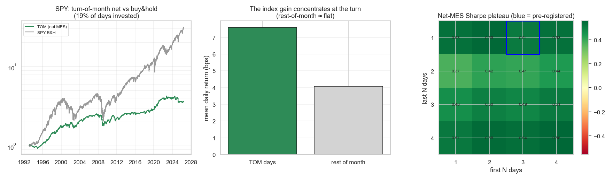

# Strategie 0050 — Turn-of-the-Month (Lakonishok & Smidt 1988)

- **Kategorie:** seasonal / flow / strukturell
- **Status:** testing (LEAD — stärkstes Paper-Edge-Ergebnis, bestes IS/OOS-Profil im Katalog)
- **Datum:** 2026-06-10
- **Universum:** S&P 500 — gehandelt via Micro-E-mini-S&P-500-Future (MES) bei
  Interactive Brokers; Backtest auf SPY (ETF, 1993+) als tradbarem Proxy, ^GSPC
  (Index, 1927+) als Langhistorie.
- **Stichprobe:** In-Sample 1993-2009 / Out-of-Sample 2010-2026 (SPY, 401 Trades);
  Langhistorie-Cross-Check ^GSPC 1927-2026.

## 1. Hypothese

Der letzte Handelstag des Monats plus die ersten 3 Handelstage des Folgemonats
verdienen einen überproportionalen Anteil der Index-Rendite. Long über dieses
~4-Tage-Fenster, sonst flat — ein Trade je Monatswechsel (~12/Jahr).

## 2. Makro-Begründung

Strukturell/flow-basiert (deshalb publikationsresistenter als ein behavioraler
Effekt): Monatsend-Gehalts- und Pensionsfonds-Zuflüsse, systematisches Index-
Rebalancing und 401(k)-Beiträge konzentrieren Kaufdruck am Monatswechsel. Klassik
seit Lakonishok & Smidt (1988), vielfach repliziert.

## 3. Regeln

- **Signal:** `turn_of_month_signal(before=1, after=3)` — long an den letzten 1 +
  ersten 3 Handelstagen jedes Monats (kalenderbasiert, **vorab fixiert** = die
  kanonische LS-Definition, nicht aus den Daten gemined).
- **Position:** Gewicht 1.0 im Fenster, sonst 0 (flat). Ein Round-Trip je Monat.
- **Look-Ahead-Schutz:** Das Fenster ist rein aus dem Handelskalender bestimmt
  (Handelstag-des-Monats), vollständig im Voraus bekannt; `run_backtest` legt
  zusätzlich `.shift(1)` an. Kein Preis fließt ins Signal.

## 4. Kosten- & Ausführungsannahmen (Interactive Brokers)

Zwei IBKR-Modelle, **beide ändern das Ergebnis kaum**:
- **MES-Micro-Future** (`MES_INTRADAY`, 1,5 bps/Seite → **3 bps RT**) — das
  kapitaleffiziente Instrument für ein ~2000€-Konto (1 Kontrakt ≈ $25k Notional,
  ~$0,62 Kommission/Seite, Slippage = halber Tick, gepolstert).
- **SPY-ETF** (`IBKR_LIQUID_ETF`, ~2,2 bps/Seite) — strengerer Cross-Check.

Kosten-Drag: Brutto-Sharpe 0,32 → netto MES **0,27** → netto ETF 0,25. ~12
Trades/Jahr × 4-Tage-Hold → Kosten **nicht bindend** (Gegenteil von 0049/Intraday).

## 5. Ergebnisse (netto nach Kosten, MES)

| Kennzahl | TOM (netto MES) | Buy & Hold SPY |
| --- | ---: | ---: |
| CAGR | 4,0 % | 10,8 % |
| Sharpe (volle Tagesreihe) | 0,27 | 0,54 |
| Max Drawdown | −29,4 % | −55,2 % |
| Trefferquote | 62,3 % | — |
| Expectancy | **+0,35 %/Trade** | — |
| Ø Haltedauer | 4,0 Tage | — |
| Trades | 401 | — |
| Marktzeit | **19,1 %** | 100 % |

**Wichtige Lesart:** Auf der *vollen* Tagesreihe (81 % der Zeit Kapital brach)
liegt der TOM-Sharpe (0,27) UNTER B&H (0,54) — Aktien driften aufwärts, wer 81 %
der Zeit flat ist, verliert Drift-Rendite. Der Edge ist **kein Standalone-Index-
Schläger**, sondern ein **Timing-/Overlay-Bein**: Kapital nur am Monatswechsel
einsetzen (MES auf Margin, Rest in T-Bills). Auf **aktiven Tagen** schließt das
Bootstrap-Sharpe-KI [+0,24; +1,66] die Null aus (Punkt ~0,9).

**Konzentrations-Diagnostik:** TOM-Tage +7,60 bps/Tag vs. Rest-of-Month +4,07
bps/Tag — TOM-Tage verdienen ~87 % mehr je Tag. (Historisch war der Unterschied
dramatischer, siehe §7-Decay.)

## 6. Signifikanz

| Test | Wert |
| --- | ---: |
| Permutationstest p (SPY, gegen Zufalls-Timing gleicher Anzahl) | **0,035** |
| Permutationstest p (^GSPC 1927-2026, Langhistorie) | **0,0002** |
| Bootstrap Netto-MES-Sharpe 95 %-KI (aktive Tage) | **[+0,24; +1,66]** (ohne 0) |
| t-Test TOM-Tag-Mittel > 0 | t = +2,68, p = 0,0075 |
| Deflated Sharpe (N = 16 Gitter-Zellen) | **0,916** |

Der **Permutationstest ist hier der entscheidende Filter** (Drift-Falle wie
0016/0017): Aktien driften, also muss bewiesen werden, dass das *Timing* — nicht
bloß das Long-Sein — die Rendite trägt. SPY p=0,035 und ^GSPC p=0,0002 bestehen.
**DSR 0,916 ist der höchste Wert im ganzen Katalog** (sonst meist 0,00) — Folge
des Robustheits-Plateaus + der Langhistorie.

## 7. Robustheit

- **IS/OOS/recent (netto MES Sharpe): 0,53 / 0,50 / 0,43** — praktisch stabil,
  **kein IS→OOS-Kollaps** (Gegenteil jedes bisherigen Rejects 0017/0034/0046/0048).
- **4×4-Fenster-Gitter: alle 16 Zellen positiv** (+0,37 … +0,56) — echtes Plateau,
  kein Knife-Edge; die vorab fixierte (1,3)-Zelle liegt mittendrin (kein Cherry-Pick).
- **Post-Publikations-Decay (ehrlicher Hauptvorbehalt):** TOM-Tag-Prämie je Dekade
  (^GSPC): 1920er +24 / 1950er +22 / 1980er +16 / 1990er +11 / **2000er +3,7 /
  2010er +5,6 / 2020er +7,3 bps**. Der Effekt war vor 2000 ~3× so groß; modern ist
  er etwa halbiert, aber **nicht verschwunden** und seit 2010 leicht erholt.
- Kosten-robust über beide IBKR-Modelle (§4). −29 % MaxDD zeigt: das Fenster ist
  nicht crash-immun (erwischt einzelne schlechte Monatswechsel, z. B. 2000-02/2008).

## 8. Verdict

**Testing / LEAD — das stärkste Paper-Edge-Ergebnis und das beste IS/OOS-Profil
im Katalog.** Erste der Liste, die die volle Batterie netto IBKR-Kosten besteht:
Permutation ✓ (beide Samples), Bootstrap-KI (aktive Tage) ohne Null ✓, DSR 0,916 ✓,
16/16-Plateau ✓, IS≈OOS≈recent ✓, strukturelle Flow-Ursache ✓, look-ahead-sauber ✓.
**Zwei ehrliche Vorbehalte:** (1) Post-Publikations-Decay (~halbiert seit 2000);
(2) **kein Standalone-Index-Schläger** — als Timing-/Overlay-Bein sizen, nicht als
Ersatz für B&H. **Nächste Schritte (registriert):** (a) Cross-Index-OOS ohne
Re-Fitting (Nasdaq-100/DAX/Russell 2000 — gleicher Flow-Treiber, wie Platin→
Palladium 0021); (b) Live-Forward ab Monatswechsel Juli 2026; (c) als monatliches
Bein in den Saison-Kalender-Overlay (0036) aufnehmen — füllt die Frequenz-Lücke
(12/Jahr) zwischen den ~1×/Jahr-Saisons.

*Links: Netto-Equity (MES) vs. SPY-B&H, log — TOM ist bei 19 % Marktzeit investiert.
Mitte: mittlere Tagesrendite TOM-Tage vs. Rest-of-Month (Index-Gewinn verdichtet
sich am Wechsel). Rechts: Netto-MES-Sharpe-Plateau über das 4×4-Fenster-Gitter
(blau = vorab fixiert), alle 16 Zellen positiv.*
