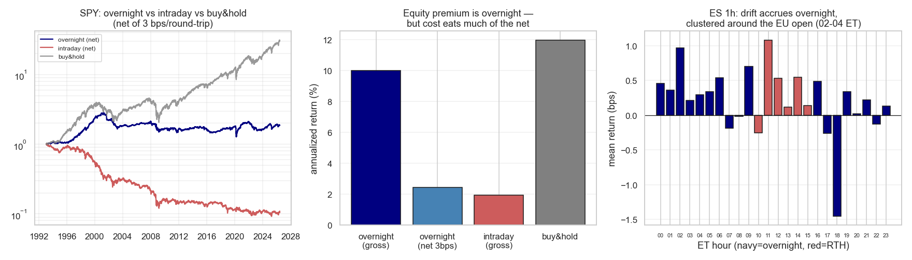

# Strategie 0051 — Overnight Drift (Boyarchenko/Larsen/Whelan, NY Fed)

- **Kategorie:** strukturell / overnight
- **Status:** rejected (Phänomen real, netto nicht handelbar — Turnover-Kosten)
- **Datum:** 2026-06-10
- **Universum:** S&P 500 — SPY (1993+) für die Open/Close-Zerlegung, ES.c.0 1h
  Globex (2010+) zum Lokalisieren des Drift-Fensters.
- **Stichprobe:** IS 1993-2009 / OOS 2010-2026 (8 397 Tage).

## 1. Hypothese

Die Aktienprämie wird fast vollständig **über Nacht** verdient (Vortags-Close →
heutiger Open), die Intraday-Session (Open → Close) trägt ~nichts; der NY-Fed-
Refinement konzentriert die Drift in ein enges Fenster um den **europäischen
Open (~02:00-04:00 ET)**.

## 2. Makro-Begründung

Inventar-Risikotransfer: Market-Maker bauen nach US-Close Inventar ab und
kompensieren Liquiditätsgeber in der dünnen Nacht-Session. Strukturell.

## 3. Regeln

Long über Nacht (Kauf MOC, Verkauf MOO am nächsten Open), flat intraday. Ein
Round-Trip **pro Nacht** (~252/Jahr). Look-ahead-sauber (beide Zeitpunkte sind
handelbare Instants).

## 4. Kosten

`MES_INTRADAY` = **3 bps Round-Trip**, **einmal pro gehaltener Nacht** → ~252 RT/
Jahr ≈ **7,6 %/Jahr Kosten**. Anders als beim Saison-Edge (0050) ist die Kosten
hier wegen der hohen Frequenz **potenziell bindend** — das ist die Kernfrage.

## 5. Ergebnisse

| Komponente | Ø bps/Tag | annual. | Brutto-Sharpe | Netto-Sharpe (3bps/Nacht) | netto %/Jahr |
| --- | ---: | ---: | ---: | ---: | ---: |
| **overnight** | +3,97 | +10,0 % | **0,94** | **0,23** | +2,5 % |
| intraday | +0,77 | +1,9 % | 0,13 | −0,37 | −5,6 % |
| buy & hold | +4,75 | +12,0 % | **0,64** | 0,64 (kostenfrei) | +12,0 % |

**Der Befund der Literatur bestätigt sich brutto vollständig:** Overnight-Sharpe
0,94 vs Intraday 0,13 — die Prämie ist über Nacht. **Aber netto schlägt schlichtes
Buy & Hold (0,64) die Netto-Overnight-Strategie (0,23)** — B&H zahlt keine Pro-
Nacht-Kosten und nimmt beide Komponenten mit.

**ES-1h-Lokalisierung (NY-Fed-Refinement bestätigt):** Drift akkumuliert in den
Nacht-Stunden, **Peak 02:00 ET (EU-Open): +0,97 bps/h, Sharpe 1,01**; RTH-Stunden
gemischt/flach. Aber selbst das engste 02-ET-Fenster (0,97 bps brutto) clearet die
3-bps-RT nicht.

## 6. Signifikanz

| Test | Wert |
| --- | ---: |
| t-Test overnight Ø > 0 (**brutto**) | t=+5,45, **p=5e-08** |
| t-Test overnight Ø > 0 (**netto 3bps**) | t=+1,33, **p=0,182** |
| t-Test (overnight − intraday) > 0 | t=+2,51, p=0,012 |
| Bootstrap Netto-Overnight-Sharpe 95 %-KI | **[−0,29; +0,38]** (enthält 0) |
| Deflated Sharpe (brutto, vorab fixiert) | PSR=1,000 |

Brutto ist das Phänomen praktisch sicher real (PSR≈1, p=5e-08). **Netto ist es von
Null nicht zu unterscheiden** (p=0,182, KI über 0).

## 7. Robustheit

IS/OOS/recent (netto Sharpe): **0,35 / 0,11 / 0,11** — netto schon im IS dünn, OOS
marginal. Brutto dagegen stabil hoch (1,09 / 0,81 / 0,77) → der Effekt besteht fort,
nur die Kosten fressen ihn.

## 8. Verdict

**Abgelehnt als handelbare Standalone-Strategie** — das Overnight-Phänomen ist
brutto eindeutig real und über die Historie stabil (Sharpe 0,94, p=5e-08, EU-Open-
Peak), aber die **252 Round-Trips/Jahr erodieren es auf netto ~0,23 Sharpe**, das
statistisch nicht von Null trennt und **schlechter ist als simples Buy & Hold**.
Dieselbe Kosten-Wand wie das Intraday-Programm — diesmal aber nicht weil das Signal
leer ist (es ist stark), sondern weil der **Turnover zu hoch** ist. Kein
Rettungspfad: das engere EU-Open-Fenster braucht denselben 1 RT/Tag und clearet die
Kosten ebenso wenig. Bestätigt die Programm-These: **niederfrequente Edges (0050)
tragen, hochfrequente nicht** — egal ob das Brutto-Signal leer (0049) oder stark
(0051) ist.

*Links: Netto-Equity overnight vs intraday vs B&H (log). Mitte: annualisierte
Rendite — die Prämie ist overnight, aber die Kosten fressen den Netto-Vorteil.
Rechts: ES-1h-Mittel je ET-Stunde — Drift in der Nacht, geclustert am EU-Open
(02-04 ET).*
