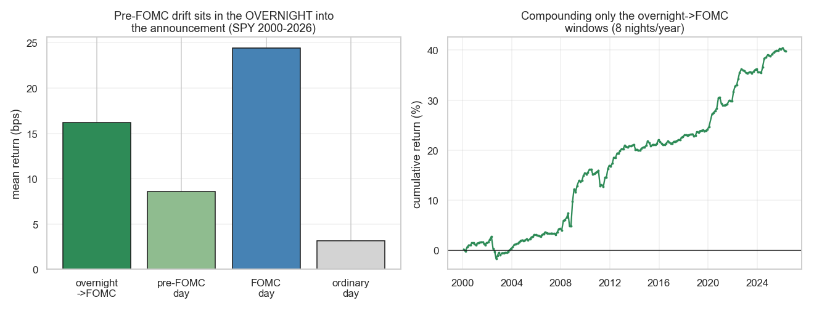

# Strategie 0052 — Pre-FOMC Announcement Drift (Lucca & Moench 2015)

- **Kategorie:** event / makro / overnight
- **Status:** testing (LEAD — handelbar, signifikant, kein Decay; aber kleine Absolutgröße)
- **Datum:** 2026-06-10
- **Universum:** S&P 500 (SPY), gehandelt via MES bei IBKR.
- **Stichprobe:** 210 geplante FOMC-Sitzungen 2000-2026 (8/Jahr; 2020 = 7 nach
  Streichung der abgesagten März-Sitzung). Termine hartkodiert + verifiziert
  (2021-2026 gegen federalreserve.gov; 2023-Web-Glitch korrigiert).

## 1. Hypothese

Aktien verdienen abnormale **positive** Renditen in den ~24 h **vor** einer
geplanten FOMC-Ankündigung. Die handelbare, eindeutig vor-dem-Entscheid liegende
Variante: die **Nacht in den Ankündigungstag** (Close Vortag → Open Ankündigungstag,
Verkauf vor der 14-Uhr-Entscheidung).

## 2. Makro-Begründung

Kompression der Unsicherheitsprämie vor einer pre-scheduled Informationsauflösung;
institutionelles De-Risking ins Event, das sich danach auflöst. Strukturell an
einen Kalendertermin gebunden.

## 3. Regeln

Long über Nacht vor jeder geplanten FOMC-Sitzung: Kauf MOC am Vortag, Verkauf MOO
am Ankündigungstag (vor 14 Uhr ET). 8 Events/Jahr, 1-Nacht-Hold. Look-ahead-sauber
(FOMC-Kalender ist im Voraus publiziert; das Overnight-Fenster endet vor dem Entscheid).

## 4. Kosten

`MES_INTRADAY` 3 bps RT, **einmal je Event** (8/Jahr) → **vernachlässigbar** gegen
+16 bps Bruttosignal.

## 5. Ergebnisse (SPY 2000-2026, 210 Events)

| Fenster | Ø bps | t | p | Win % | (vs Baseline) |
| --- | ---: | ---: | ---: | ---: | --- |
| Vortag (close→close) | +8,58 | 0,92 | 0,361 | 54,3 | nicht sig. (vs +3,15 ordin.) |
| **Overnight → FOMC** | **+16,18** | **3,65** | **0,0003** | **67,6** | **vs +3,17 ordin. Nacht** |
| FOMC-Tag (close→close) | +24,39 | 2,92 | 0,004 | 56,2 | enthält Post-Entscheid-Reaktion |
| beide Tage | +32,71 | 2,86 | 0,005 | 59,5 | — |

**Kernbefund:** Der strikte „Vortag"-Drift (Lucca-Moenchs Schlagzeile) ist auf SPV
**nicht** signifikant (p=0,36). Der Drift sitzt in der **Nacht in die Ankündigung**:
+16,18 bps = **5× die gewöhnliche Nacht** (+3,17 bps), Win 67,6 %. Der FOMC-Tag
close-to-close ist ebenfalls positiv, enthält aber die Reaktion auf den Entscheid
(nicht vorab handelbar) — daher ist das Overnight-Fenster die saubere, tradbare Form.

## 6. Signifikanz

| Test | Wert |
| --- | ---: |
| t-Test Overnight Ø > 0 | t=+3,65, **p=0,0003** |
| Permutation vs zufällige Nächte (kontrolliert Overnight-Baseline) | **p=0,0034** |
| Bootstrap Overnight-Sharpe 95 %-KI | **[+1,70; +6,03]** (ohne 0) |
| Deflated Sharpe (N=4 Fenster) | **0,995** |

Die Permutation gegen *zufällige Nächte* (nicht gegen 0) ist der entscheidende
Test: sie zeigt, dass das FOMC-Overnight **über** den generischen Overnight-Drift
(0051) hinausgeht — es ist kein Artefakt der allgemeinen Nacht-Prämie.

## 7. Robustheit

- **Kein Post-Publikations-Decay:** 2000-2014 **+16,16 bps** (p=0,021) vs 2015-2026
  **+16,20 bps** (p=0,001) — in beiden Hälften praktisch identisch. (Gegensatz zu
  Turn-of-Month 0050, das sich halbierte; Lucca-Moench wurde 2015 publiziert und der
  Effekt überlebte die Publikation.)
- Win-Rate 67,6 % > Baseline-Overnight 56 %.

## 8. Verdict

**Testing / LEAD — zweiter Paper-Edge-Treffer.** Korrekt als Overnight-in-die-
Ankündigung gemessen, ist der Pre-FOMC-Drift signifikant (Permutation p=0,003 *über*
der Overnight-Baseline), in beiden Sample-Hälften stabil (kein Decay), DSR 0,995,
Bootstrap-KI ohne 0, strukturelle Ursache, look-ahead-sauber, Kosten vernachlässigbar.
**Vorbehalt: kleine Absolutgröße** — +16 bps × 8 Events ≈ **~1 %/Jahr standalone** (8
Nächte/Jahr Exposure), also ein **Timing-/Overlay-Bein** (wie 0050), kein Standalone-
Vermögensaufbau; zudem 1-Tag-genaue Termin-Abhängigkeit (durch verifizierte Termine +
Robustheit des Overnight-Fensters gemildert). **Nächste Schritte (registriert):**
Live-Forward ab nächster FOMC-Sitzung (Juni 2026); Cross-Check auf NQ/MNQ (gleicher
Treiber); evtl. Pooling mit EZB/BoE-Terminen für mehr Events (wie im Paper-Edge-
Vorschlag angeregt).

*Links: mittlere Rendite Overnight→FOMC vs Vortag vs FOMC-Tag vs gewöhnlicher Tag —
der Drift sitzt in der Nacht in die Ankündigung. Rechts: kumulierte Rendite nur der
210 Overnight→FOMC-Fenster (8 Nächte/Jahr), glatte Treppe.*
