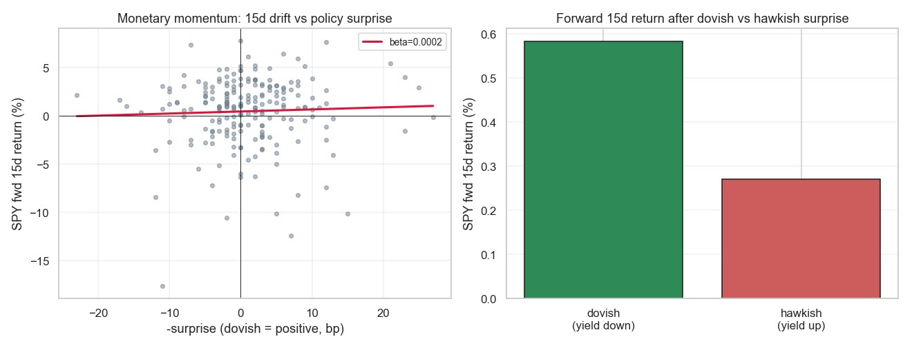

# Strategie 0053 — Monetary Momentum (Neuhierl & Weber)

- **Kategorie:** event / makro / momentum
- **Status:** rejected (kein signifikanter Drift mit Yield-Surprise-Proxy)
- **Datum:** 2026-06-10
- **Universum:** S&P 500 (SPY). Surprise-Proxy: 2-J-Treasury-Yield (FRED DGS2).
- **Stichprobe:** 210 FOMC-Sitzungen 2000-2026 (Termine wie 0052).

## 1. Hypothese

Aktien driften ~15 Handelstage nach der FOMC-Entscheidung in Richtung des
geldpolitischen **Surprise**: dovish (Yield fällt) → positiver Drift, hawkish
(Yield steigt) → negativer Drift. Ursache: langsame Diffusion makroökonomischer
Information / Under-Reaction.

## 2. Regeln

Surprise = 2-J-Yield-Änderung am Ankündigungstag (Yield[A]−Yield[A−1]). Signal =
−sign(Surprise): long nach dovish, short nach hawkish; Einstieg Ankündigungs-Close,
Halten h Tage. Look-ahead-sauber (Surprise am Close beobachtet, dann gehandelt).
8 Events/Jahr → Kosten vernachlässigbar.

## 3. Ergebnisse (signed strategy, SPY 2000-2026, 210 Events)

| Horizont | beta(fwd ~ −surprise) | corr | signiert Ø % | t | p | Win % |
| ---: | ---: | ---: | ---: | ---: | ---: | ---: |
| 5 d | 0,0000 | 0,005 | +0,180 | 1,21 | 0,227 | 47,6 |
| 10 d | 0,0000 | 0,006 | +0,159 | 0,88 | 0,377 | 48,6 |
| **15 d** | 0,0002 | 0,042 | +0,166 | 0,71 | 0,481 | 46,7 |
| 20 d | 0,0003 | 0,046 | +0,302 | 1,11 | 0,268 | 49,5 |

**Headline h=15:** dovish Forward +0,58 % vs hawkish +0,27 % → Spread **+0,31 pp**
(richtungsmäßig wie vorhergesagt, aber winzig). Permutation (Surprise-Vorzeichen
geshuffelt) **p=0,276**; Bootstrap-Mittel-KI [−0,29 %; +0,62 %] enthält 0; DSR 0,363.

## 4. Verdict

**Abgelehnt.** Der Monetary-Momentum-Drift ist mit dem 2-J-Yield-Surprise-Proxy
auf SPV nicht nachweisbar — die Richtung stimmt (dovish → höherer Forward-Return),
aber die Korrelation ist ~0 (0,04 bei h=15), die signierte Strategie ein Münzwurf
(Win 47 %, p=0,48), und die Permutation nicht signifikant (p=0,28). **Ehrlicher
Vorbehalt:** der saubere Kuttner-Surprise braucht Fed-Funds-Futures-Intraday-Daten;
der 2-J-Yield-Tagesänderungs-Proxy ist verrauschter (der 2-J-Yield bewegt sich an
FOMC-Tagen aus vielen Gründen) → ein schwaches Ergebnis kann teils Proxy-Rauschen
sein. Aber mit der frei verfügbaren Datenlage trägt der Effekt keinen handelbaren
Edge. Reiht sich neben 0049/0053 als Paper-Edge ohne Puls in diesem Setup.

*Links: 15-Tage-Forward-Return vs −Surprise (nahezu flache Steigung, beta≈0).
Rechts: Forward-15d nach dovish vs hawkish Surprise — Differenz klein und insignifikant.*
