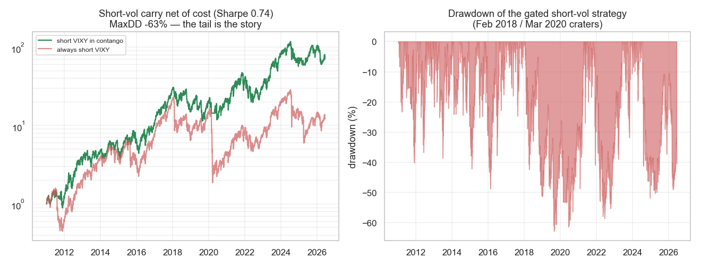

# Strategie 0054 — VRP / VIX-Terminstruktur-Carry (Simon & Campasano)

- **Kategorie:** carry / volatility / risk-premium
- **Status:** rejected fürs Konto (echter Edge, aber Tail-Risiko inkompatibel) — deferred
- **Datum:** 2026-06-10
- **Universum:** VIX-Terminstruktur (^VIX / ^VIX3M); handelbar via VIXY (Short = Carry ernten).
- **Stichprobe:** 2011-2026 (VIXY-Historie, 3 881 Tage).

## 1. Hypothese

VIX-Futures stehen meist in Contango (Käufer von Crash-Schutz überzahlen
systematisch) → **Short** Front-Vol erntet den Roll-Down. Refinement: nur shorten,
wenn die Terminstruktur in Contango ist (VIX3M > VIX), in Backwardation flat.

## 2. Makro-Begründung

Versicherungsprämie — strukturell und persistent. **Kehrseite (Tier-2-Grund):
brutales Tail-Risiko** (Feb 2018 „Volmageddon", März 2020).

## 3. Regeln

Position −1 (short VIXY) wenn VIX3M > VIX, sonst flat. Look-ahead-sauber
(Terminstruktur am Close bekannt, Engine shiftet +1). IBKR-ETF-Kosten.

## 4. Ergebnisse (2011-2026)

| | Sharpe | CAGR | MaxDD |
| --- | ---: | ---: | ---: |
| **Short VIXY in Contango** | **0,74** | 31,8 % | **−62,9 %** |
| Always-Short VIXY (kein Gate) | 0,57 | 17,6 % | −91,8 % |

**Das Signal funktioniert:** Contango an 92,2 % der Tage; nächster VIXY-Tag in
Contango **−19,9 bps** vs Backwardation +20,7 bps — die Terminstruktur prognostiziert
den Vol-Verfall sauber. Das Gate hilft (MaxDD −63 % statt −92 %, höherer Sharpe).

## 5. Signifikanz

| Test | Wert |
| --- | ---: |
| Permutation p | **0,005** |
| Bootstrap Sharpe 95 %-KI | [+0,24; +1,29] (ohne 0) |
| Deflated Sharpe (N=2) | **0,993** |

Statistisch ein klarer „Pass" — **aber Sharpe/DSR sind blind für den Links-Tail.**

## 6. Tail-Risiko (der eigentliche Befund)

- **5 schlechteste Tage:** −33,6 % (2020-06-11), −25,0 %, −24,1 %, −24,0 %, −20,8 %.
  Ein einzelner −34 %-Tag ist auf einem ~2000 €-(gehebelten)-Konto **kontoendend**.
- **Feb 2018 Volmageddon:** −11,0 % kumuliert, schlechtester Tag −13,6 % (das Gate
  dämpfte hier; reine Short-Vol-Produkte wie XIV verloren ~96 % an einem Tag).
- **März 2020 COVID:** −26,2 % kumuliert, schlechtester Tag −18,4 %.

## 7. Verdict

**Echter Edge — abgelehnt für DIESES Konto auf Risiko-, nicht Signal-Gründen.**
Anders als 0049/0053 (leeres Signal) ist die Varianz-Risikoprämie real, signifikant
(p=0,005, DSR 0,993) und mit ordentlichem Sharpe (0,74) erntbar. **Aber das Tail-
Risiko (−34 %-Einzeltage, −63 % MaxDD) ist mit einem kleinen Konto / prop-artigen
Tages-Drawdown-Limits unvereinbar** — exakt der vom Vorschlag genannte „brutale Tail,
nur mit hartem Hedge, später". **Wichtige Methoden-Lehre: Sharpe und DSR belohnen
diese Strategie, erfassen aber den katastrophalen Links-Tail nicht** (der −34 %-Tag
ist >10σ der Tagesverteilung) — bei Short-Vol/Short-Gamma sind Standard-Risikomaße
irreführend; MaxDD + Worst-Day + Kurtosis müssen das Urteil dominieren. **Wieder
aufnehmen nur mit Defined-Risk-Struktur** (Long-OTM-VIX-Calls / Put-Spread als
Tail-Hedge), außerhalb des aktuellen Scopes.

*Links: Netto-Equity short-VIXY-in-Contango vs always-short (log) — hoher Sharpe, aber
tiefe Krater. Rechts: Drawdown — Feb 2018 / März 2020 / Juni 2020 als −60 %-Einbrüche.*
