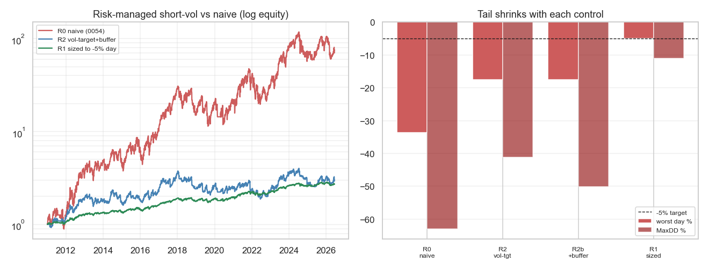

# Strategie 0056 — Risk-managed VIX-Carry (Defined-Risk-Variante von 0054)

- **Kategorie:** carry / volatility / risk-managed
- **Status:** testing (kleines Defined-Risk-Sleeve — Edge überlebt das Sizing, aber bescheidene Absolutgröße)
- **Datum:** 2026-06-10
- **Universum:** VIX-Terminstruktur (^VIX/^VIX3M), handelbar via VIXY (Short = Carry).
- **Stichprobe:** 2011-2026 (3 881 Tage).

## 1. Ausgangslage

0054 zeigte: die VRP-Carry ist ein **echter, signifikanter** Edge (Sharpe 0,74,
p=0,005, DSR 0,993), aber mit kontoendendem Links-Tail (schlechtester Tag −34 %,
MaxDD −63 %) → abgelehnt auf Risiko. Frage hier: lässt sich derselbe Edge in ein
für ein kleines IBKR-Konto **tolerierbares** Sleeve bringen?

## 2. Was funktioniert — und was nicht

| Variante | Sharpe | CAGR | MaxDD | schlecht. Tag | Kurtosis |
| --- | ---: | ---: | ---: | ---: | ---: |
| R0 naive (= 0054) | 0,74 | 31,8 % | −62,9 % | −33,6 % | 6,1 |
| **R1 naive linear gesized auf −5 %-Tag (×0,149)** | **0,55** | **6,6 %** | **−11,1 %** | **−5,0 %** | 6,1 |
| R2 Vol-Targeting | 0,45 | 11,0 % | −41,1 % | −17,5 % | **10,5** |
| R2b Vol-Targeting + Puffer-Gate | 0,32 | 7,2 % | −50,2 % | −17,5 % | 11,9 |

**Kernbefund 1 — Vol-Targeting hilft bei Short-Vol NICHT** (kontraintuitiv): es
senkt den Sharpe (0,74→0,32) *stärker* als den Tail und **erhöht** sogar die
Kurtosis (6→12). Grund: der Short-Vol-Tail ist **gap-getrieben** — der Crash
passiert, bevor die realisierte Vol das Exposure-Target herunterzieht, also ist
die Position am Gap-Tag noch groß. Vol-Targeting schneidet die ruhige Carry-Ernte
weg, sieht den Gap aber nicht kommen. Nach Vol-Targeting+Puffer ist die Permutation
sogar p≈0,90 → Edge zerstört.

**Kernbefund 2 — pures lineares Down-Sizing ist der richtige Hebel.** Skalieren
eines Return-Streams ist linear → der Edge (Sharpe-Charakter, Permutation, DSR)
bleibt erhalten, nur die Absolutgröße schrumpft. Mit Faktor 0,149 (sodass der
schlimmste historische Tag = −5 %) ergibt sich ein **echtes, signifikantes Sleeve**:
Sharpe 0,55, CAGR 6,6 %, MaxDD −11 %.

## 3. Signifikanz des gesizten Sleeves

| Test | Wert |
| --- | ---: |
| Permutation p | **0,012** |
| Bootstrap Sharpe 95 %-KI | [+0,06; +1,09] (ohne 0) |
| Deflated Sharpe | **0,972** |

Krisen jetzt überlebbar: Feb 2018 −1,6 %, **März 2020 −4,1 %** (schlimmster Tag
−2,7 %), Aug 2024 −3,0 %.

## 4. Zwei ehrliche Vorbehalte

1. **„−5 %-Tag" ist deskriptiv für die Historie, KEINE Garantie.** Sizing auf den
   schlimmsten *vergangenen* Tag kappt keinen *künftig schlimmeren* Gap: ein
   −50 %-Roh-Tag würde das Sleeve −7,5 % kosten, nicht −5 %. Ein echtes Cap
   braucht den VIX-Call-Hedge.
2. **VIX-Call-Hedge (R3, stilisierte Kostensensitivität) frisst die Rendite:** ein
   kontinuierlicher OTM-VIX-Call-Hedge cappt das künftige Tail, kostet aber ~1-5 %/Jahr.
   Auf 6,6 % CAGR: Drag 1 % → 5,6 %; **3 % → 3,6 % (Sharpe 0,19)**; 5 % → 1,6 %
   (Sharpe ~0). Das ist das fundamentale VRP-Dilemma: die Versicherung gegen den
   Tail kostet ungefähr so viel wie die Prämie, die man erntet. (Stilisiert, da
   exakte Optionspreise außerhalb der Gratis-Datenlage; als Sensitivität robust.)

## 5. Verdict

**Testing — aus dem Outright-Reject (0054) wird durch lineares Sizing ein
legitimes, signifikantes Defined-Risk-Sleeve** (Sharpe 0,55, ~6,6 %/Jahr, MaxDD
−11 %, schlechtester Tag −5 %, p=0,012). **Aber bescheidene Absolutgröße** — 6,6 %
auf den allokierten Bruchteil eines ~2000 €-Kontos ist als kleines Satellit-Sleeve
sinnvoll, nicht als Kern. **Die zwei Methoden-Lehren wiegen schwerer als die
Strategie selbst:** (a) **Vol-Targeting versagt bei gap-getriebenem Short-Vol** —
das Standard-De-Risking-Werkzeug ist hier das falsche; (b) **lineares Sizing erhält
den Edge** (Sharpe/Permutation/DSR invariant), schrumpft nur die Größe → der saubere
Weg, einen Tail-lastigen Edge konto-verträglich zu machen, solange man den Rest-Gap
akzeptiert oder per VIX-Calls (mit Rendite-Kosten) cappt. **Empfehlung:** als kleines
optionales Satellit-Sleeve handelbar, wenn der User Vol-Carry-Exposure will und den
Rest-Gap akzeptiert; Priorität bleibt unter den niederfrequenten Leads 0050/0052.

*Links: Log-Equity naiv (0054) vs Vol-Target vs gesized-auf-−5 %. Rechts: schlechtester
Tag + MaxDD je Kontrolle — nur das lineare Sizing bringt den Tail sauber auf das −5 %-Ziel.*
