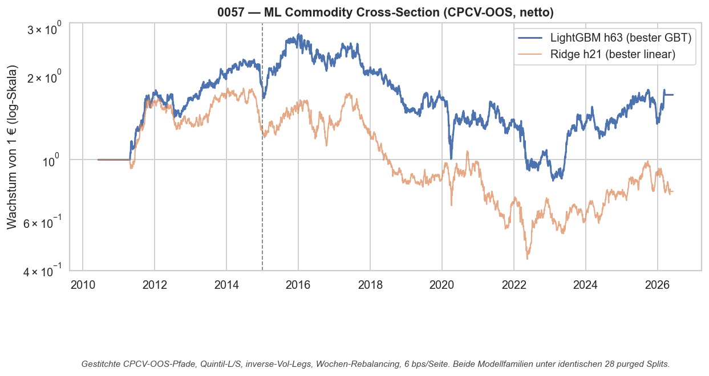
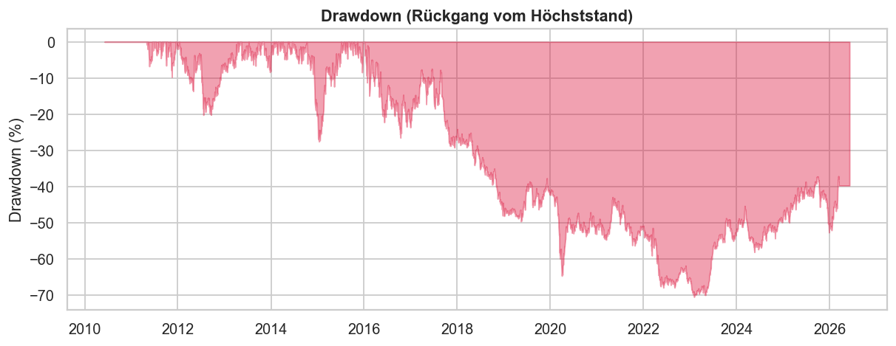
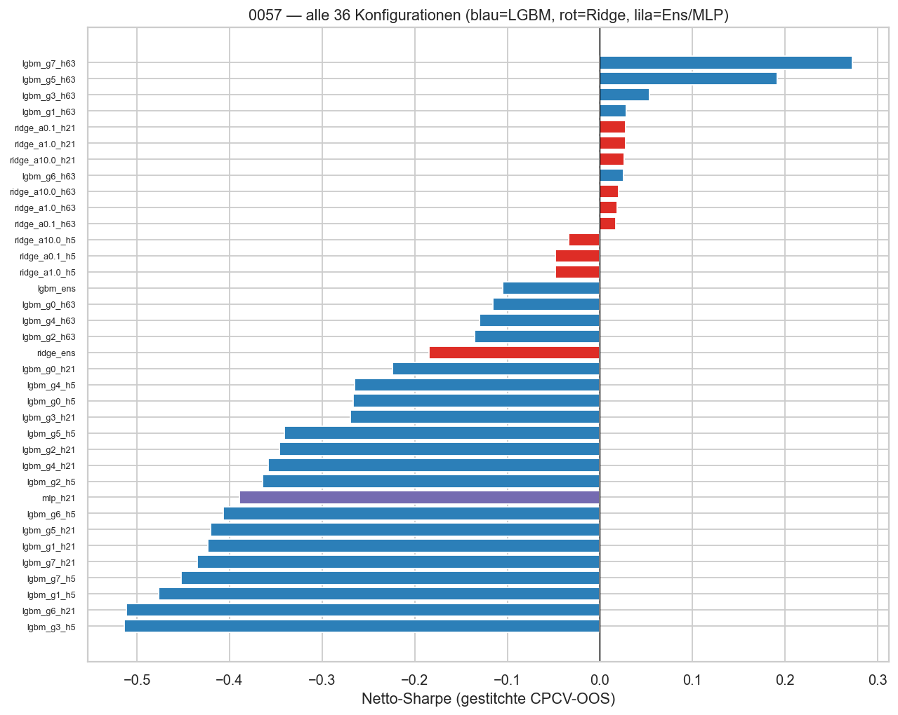

# Strategie 0057 — ML-Signalgenerierung auf der Commodity-Cross-Section (LightGBM vs. Ridge unter CPCV)

- **Kategorie:** machine-learning / cross-sectional multi-factor
- **Status:** rejected (sauberes, gut begründetes Null)
- **Datum:** 2026-06-11
- **Universum:** 17 liquide CME/NYMEX/COMEX/CBOT-Futures — WTI Rohöl, Erdgas,
  Heizöl, Benzin, Gold, Silber, Kupfer, Platin, Palladium, Mais, Weizen,
  Sojabohnen, Sojaöl, Sojamehl, Lebendrind, Mastrind, Magerschwein.
  ICE-Softs (Zucker, Kaffee, Kakao, Baumwolle, Orangensaft) fehlen, weil
  Databento GLBX sie nicht führt — dokumentierte Universums-Einschränkung.
- **Stichprobe:** 2011-04 bis 2026-06 (Feature-Warmup ab Daten-Start 2010-06).
  Kein klassischer IS/OOS-Split — Validierung via **CPCV** (28 kombinatorische
  purged Splits), jede Vorhersage ist out-of-sample.

## 1. Hypothese

Bekannte Rohstoff-Risikoprämien (Carry, Basis-Momentum, Momentum, Hedging
Pressure, Skewness, Vol-Regime, Makro-Zustand) tragen **nichtlinear und
zustandsabhängig kombiniert** (LightGBM) mehr Information über den
1W-/1M-/3M-Querschnitt als ein lineares Faktormodell (Ridge) — Roadmap
`ML-COMMODITY-SIGNAL-ROADMAP.md`, vorab registriert.

## 2. Makro-Begründung

Jedes Feature hat eine dokumentierte ökonomische Ursache: Lagerhaltungstheorie
(Carry/Basis), Keynes'scher Risikotransfer (Hedging Pressure aus CFTC-COT),
Underreaction (Momentum), Lotterie-Präferenz (Skew-Prämie), gemeinsame
Makro-Treiber (Dollar, Realzins, VIX). Die ML-These selbst: Interaktionen
(z. B. „Carry wirkt nur im Hoch-Vol-Regime") entgehen linearen Modellen.

## 3. Regeln

- **Features** (alle PIT-safe, pro Datum rang-transformiert, GKX-Stil):
  Carry annualisiert (Front/Second, roll-bereinigt via `instrument_id`),
  Basis-Momentum 63/252d (Boons & Prado — beide Legs roll-bereinigt),
  TS-Momentum 1/3/6/12M, Hedging Pressure + 1J-z-Score (COT: Dienstag-Daten,
  Freitag-Release **+1 Handelstag**, weil der 15:30-ET-Release nach dem
  Futures-Settlement liegt), OI-Trend 13W, Skew 252d, Vol 20/60d + Perzentil,
  Makro (Dollar-Trend, Realzins, Term-Spread, VIX; +1 Tag Shift).
- **Target:** Forward-Return 5/21/63 Handelstage, pro Datum rang-transformiert.
- **Portfolio:** Long Top-Quintil / Short Bottom-Quintil, inverse-Vol-Gewichte
  je Leg, dollar-neutral (Gross 2.0), Wochen-Rebalancing; Signale werden von
  der Engine `shift(1)` gehalten (kein Same-Bar-Zugriff).
- **Validierung:** CPCV mit 8 Gruppen / 2 Test-Gruppen = 28 Splits, Purging =
  Label-Horizont (10/35/95 Kalendertage), Embargo 1 % der Zeitachse. PBO via
  CSCV über alle 36 Konfigurationen. Statt Optuna ein **vorab fixiertes
  8-Zellen-Gitter** (LightGBM) — n_trials klein und exakt zählbar.

## 4. Kosten- & Ausführungsannahmen

6 bps pro Seite auf den Turnover (gemischtes IBKR-Futures-Modell wie 0047;
alle 17 Märkte sind CME-liquide). Kosten-Drag des Siegers: **5,0 %/Jahr** —
wöchentliches Rebalancing einer inversen-Vol-Quintil-Buchstruktur churnt.

## 5. Ergebnisse (gestitchte CPCV-OOS-Pfade, netto)

Bester GBT: `lgbm_g7_h63` (num_leaves 31, lr 0.1, 300 Bäume, 63d-Horizont).

| Kennzahl                  | Wert |
| ------------------------- | ---: |
| CAGR                      | 3,3 % |
| Sharpe (netto, 2 % rf)    | 0,17 |
| Sharpe aktive Tage (o. rf)| +0,27 |
| Sharpe brutto             | +0,52 |
| Sortino                   | 0,23 |
| Calmar                    | 0,05 |
| Max Drawdown (+ Dauer)    | **−70,5 %** (2 622 Tage) |
| Bester Ridge (netto)      | +0,03 |
| Multi-Horizont-Ensembles  | Ridge −0,18 / LGBM −0,10 |
| MLP-Negativkontrolle      | −0,39 |

## 6. Signifikanz

| Test                                   | Wert |
| -------------------------------------- | ---: |
| Permutation Rank-Shuffle (500)         | p = 0,002 * |
| Permutation Label-Retrain (30, Roadmap)| p = 0,065 |
| Deflated Sharpe (N = 36 Trials)        | **0,233** |
| t-Test mittlere Rendite (aktive Tage)  | p = 0,288 |
| PBO (CSCV, 12 870 Kombinationen)       | 0,222 |

\* Wichtige Fußnote: die Rank-Shuffle-Null hat Mittel **−0,56**, weil auch
zufällige Rankings volle Turnover-Kosten zahlen. p = 0,002 heißt also nur
„besser als zufälliges Ranking nach Kosten", nicht „signifikant > 0". Der
ehrlichere Label-Retrain-Test (Modell lernt auf pro Datum geshuffelten
Targets, kompletter CPCV-Refit) gibt p = 0,065, der t-Test gegen 0 p = 0,288.

## 7. Robustheit

- **Ridge-Gate (das zentrale Gate): VERFEHLT.** LightGBM gewinnt nur
  25 % (h5) / 32 % (h21) / 46 % (h63) der paarweisen CPCV-Splits gegen den
  besten Ridge desselben Horizonts. Die behauptete Nichtlinearität ist auf
  diesen Daten **nicht belegbar** — und Ridge selbst liegt bei ≈ 0.
- **Subperioden-Decay: massiv.** Sharpe +0,93 (vor 2015) → +0,01 (2015-2020)
  → +0,14 (ab 2020). Deckungsgleich mit 0047 (XSec-Momentum) und 0048
  (Carry): die cross-sektionalen Rohstoff-Prämien sind im 2010er-Jahrzehnt
  zerfallen; ML kombiniert zerfallene Faktoren zu einem zerfallenen Faktor.
- **Feature-Importance über Splits stabil** (mean Spearman 0,92: Term-Spread,
  Skew, Realzins, Vol, Basis-Momentum) — das Modell lernt konsistente
  Struktur, aber eine, die nach 2015 nichts mehr prognostiziert. Stabilität
  ≠ Prognosekraft.
- Horizont-Muster konsistent: h5 klar negativ (Kostenwand), h21 ≈ 0, h63 der
  einzige mit schwachem Puls — Niederfrequenz verliert am wenigsten an die
  Kosten, wie im gesamten Katalog.

## 8. Verdict

**Ablehnen — als sauberes Null.** Der eine Grund: das vorab registrierte
Ridge-Gate ist verfehlt (GBT schlägt linear nicht mehrheitlich), und was an
schwachem Brutto-Puls existiert (+0,52 brutto, h63), stammt aus der Zeit vor
2015, überlebt weder DSR (0,233) noch t-Test (0,288) und trägt einen
−70 %-Drawdown. Die Roadmap-These „weniger institutionalisiertes Universum"
hat sich für 2015+ nicht bestätigt. Wert des Programms: die wiederverwendbare
Infrastruktur (CPCV/PBO, COT-PIT-Loader, Feature-Panels, ML-Portfolio-Engine)
und die Bestätigung, dass auch nichtlineares ML die tote
Rohstoff-Cross-Section nicht wiederbelebt — Phase 4 (Per-Commodity-Hybrid)
wurde nach dem Gate-Fail bewusst NICHT gebaut (Ockham, wie 0055).

